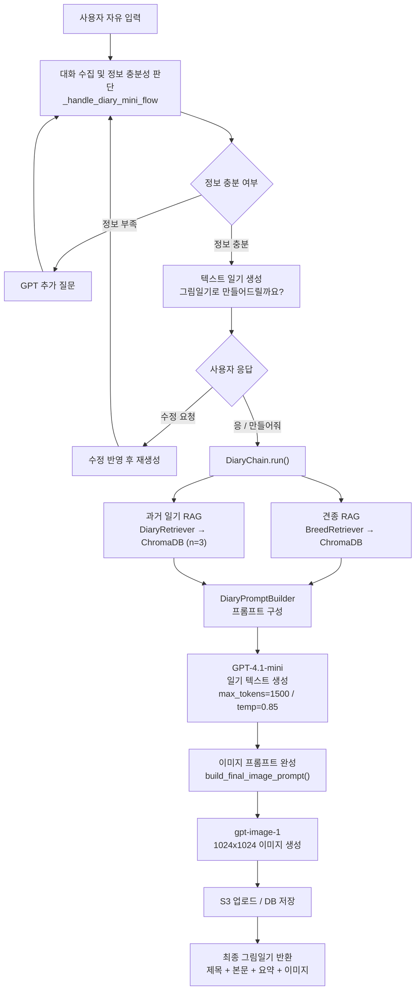
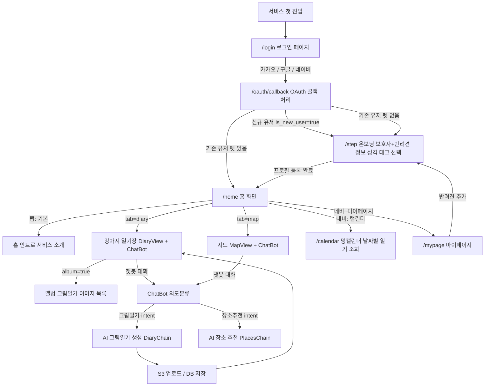

# Team. 케르베로스


<div align="center">


<table style="width:100%; max-width:1100px; text-align:center; border-collapse:collapse;">
    <tr>
    <th style="padding:12px; text-align:center;">APM</th>
    <th style="padding:12px; text-align:center;">PM</th>
    <th style="padding:12px; text-align:center;">AI Engineer</th>
    </tr>

  <tr>
    <td style="padding:10px;">이승연</td>
    <td style="padding:10px;">정유선</td>
    <td style="padding:10px;">송민채</td>
  </tr>

  <tr>
    <td style="padding:14px; line-height:1.6;">
      서비스 기획 · 화면 설계<br/>
      프론트엔드(UX/UI)<br/>
      LLM 개발 (그림일기)<br/>
      발표
    </td>
    <td style="padding:14px; line-height:1.6;">
    계정 및 리소스 결제 관리<br/>
    서버 구축 및 관리<br/>
    RDB 설계 및 관리<br/>
    FastAPI 구축 및 백엔드 개발<br/>
    LLM (의도분류) · ML (의도분류)
    </td>
    <td style="padding:14px; line-height:1.6;">
      데이터 수집 · 정제<br/>
      벡터DB<br/>
      LLM 개발 (RAG, 장소 추천)
    </td>
  </tr>

  <tr>
    <td style="padding:12px;">
      <a href="https://github.com/OOOONBBOWQ">
        
      </a>
    </td>
    <td style="padding:12px;">
      <a href="https://github.com/JYS96">
        
      </a>
    </td>
    <td style="padding:12px;">
      <a href="https://github.com/MINCHAESONG">
        
      </a>
    </td>
  </tr>
</table>


`프로젝트 기간` : 2026. 03. 26. ~ 2026. 05. 20. (38일)


<div align="center">

  <h1 style="margin:0; line-height:1; border-bottom:none;">
    <span style="font-size:64px;">
      with<span style="color:#FF8A00;">DOG</span>
    </span>
  </h1>

  

</div>

# 1. 프로젝트 개요

###  withDOG, 강아지와  더 잘 놀고 더 잘 기억하기

</div>

withDOG는 반려견 동반 장소를 추천하고 실행부터 기록까지 하나의 흐름으로 연결하는 AI 기반 통합 서비스입니다.

반려동물 양육 가구가 늘며 반려견을 동반한 장소 방문, 여행 수요는 커지고 있지만,
현재 시장은 정보가 분산되어 있고 반려견 성향이나 보호자 라이프스타일을 반영한
개인화 추천 서비스는 부족합니다.

withDOG는 탐색부터 기록까지의 경험을 하나로 이어, 반려견과의 시간을 더 쉽고 감성적으로 남길 수 있도록 합니다.

<div align="center">

# 2. 프로젝트 배경 및 목적

</div>

**국내 반려동물 양육 가구 비율은 약 30%에 달하며, 반려동물을 가족으로 여기는 '펫팸족' 문화가 확산**되고 있습니다.


이와 함께 반려견과 함께 방문할 수 있는 카페, 공원, 식당, 실내 공간 등에 대한 수요도 빠르게 증가하고 있습니다.
조선일보(2025.10.17)는 반려동물 동반 외출·관광 수요가 확대되면서 관련 장소와 인프라가 새로운 생활·관광 시장으로 주목받고 있다고 보도한 바 있다.
정부 역시 농림축산식품부 「제3차 동물복지 종합계획(2025~2029)」을 통해 **반려동물 친화 공간과 관련 인프라 확대를 추진** 중입니다.

그러나 **사용자가 실제로 반려견과 방문할 장소를 찾는 과정에서는 여전히 불편함이 존재**합니다.

한국관광공사의 「2024 반려동물 동반여행 현황 및 인식조사」에 따르면, 반려동물 동반 시 주요 장애 요인으로 숙박시설 부족 46.4%, 음식점·카페 부족 44.8%, 관광지 부족 35.7%가 제시되었다. 즉, 사용자는 반려견과 함께 갈 수 있는 장소 자체가 충분하지 않다고 느끼며, 동반 가능 여부와 이용 조건을 직접 확인해야 하는 탐색 부담을 겪고 있습니다.

따라서 **WithDOG**는 단순 추천 서비스가 아니라,
반려견의 성향과 보호자의 상황을 반영하여 일상 속 산책, 외출, 카페 방문, 실내 놀이 공간 등 다양한 반려견 동반 장소를 추천하는 AI 기반 장소 추천 서비스를 지향합니다.

---

<div align="center">

# 3. 수집 데이터 및 전처리

</div>

## 3.1. 데이터 출처 및 수집 방식
## 3.2. 데이터 전처리 파이프라인
> #### 데이터 전처리 과정

> #### 주요 전처리 시스템 및 스키마
## 3.3. 수집 데이터 현황
> #### 태그별 수집 개수

---

<div align="center">

# 4. 서비스 기능 및 모델/파이프라인 설계

<p align="center">
  
  
  
  
</p>

</div>

<div align="center">

| 기능 | 설명 | 핵심 기술 |
| --- | --- | --- |
| 1. 챗봇 의도분류 | 사용자 입력을 분석해 다이어리 작성, 장소추천, 시설정보, 기타 응답으로 라우팅합니다. | KoELECTRA Fine-tuning, FastAPI, Intent Routing |
| 2. 반려견과 보호자 성향 분석 | 온보딩에서 선택한 반려견·보호자 태그를 각각 5축 점수로 수치화하여 성향을 분석하고, 태그 텍스트 임베딩 기반 KMeans 군집화를 통해 비슷한 의미의 태그가 가까운 그룹으로 묶이는지 확인합니다. 이를 통해 성향 축 정의가 임의적이지 않음을 설명하는 근거로 활용합니다. | DogScorer, OwnerScorer, 태그 기반 벡터 점수화, Sentence-Transformers, KMeans, PCA, t-SNE |
| 3. AI 장소 추천 | 사용자 검색어, 반려견 성향, 보호자 취향, 장소 특성을 결합해 반려견 동반 가능 장소를 개인화 추천합니다. | ChromaDB 벡터 검색, 코사인 유사도, 룰 기반 점수, 카카오 지도 API |
| 4. AI 그림일기 | 챗봇 대화를 바탕으로 텍스트 일기와 동화책 스타일 이미지를 생성하고 저장합니다. | GPT-4.1-mini, gpt-image-1, ChromaDB RAG, S3 |

</div>

---

## 4.1. 챗봇 의도분류 모델

챗봇에 입력된 텍스트를 의도 분류 모델로 분석한 뒤, 각 기능에 맞는 처리 흐름으로 라우팅합니다.

<div align="center">

| 항목 | 내용 |
| --- | --- |
| 베이스 모델 | `monologg/koelectra-base-v3-discriminator` |
| 분류 클래스 | 다이어리 작성 / 장소추천 / 시설정보 / 기타 |
| 학습 설정 | epochs=5, batch=16, lr=3e-5, max_length=128 |
| 평가 지표 | Accuracy, Classification Report, per-class F1 |
| 모델 저장 | `ai/intent/model/` |
| 서비스 구조 | 메인 FastAPI 서버와 별도 포트에서 의도 분류 API 실행 |

</div>

> #### 의도 분류 흐름

```text
사용자 입력
    ↓
KoELECTRA Tokenizer
    ↓
KoELECTRA Sequence Classification
    ↓
Softmax → Intent Label 추론
    ↓
chat_response_service.py 라우팅
    ├─ 그림일기     → _handle_diary_mini_flow()
    ├─ 장소추천     → _handle_place_recommendation()
    ├─ 시설정보     → _handle_facility_info()
    └─ 기타         → 일반 GPT 응답
```

> #### 의도별 분류모델 처리 방식

<div align="center">

| 의도 | 처리 내용 |
| --- | --- |
| 그림일기 | 사용자 대화를 수집하고, 정보가 충분하면 텍스트 일기와 그림일기 생성으로 연결합니다. |
| 장소추천 | 사용자 검색어와 성향 정보를 기반으로 반려견 동반 장소를 추천합니다. |
| 시설정보 | 동물병원, 동물약국, 미용, 위탁관리 등 목적 기반 시설 정보를 제공합니다. |
| 기타 | 서비스 범위를 벗어난 일반 대화 또는 안내 응답을 제공합니다. |

</div>

---

## 4.2. 반려견과 보호자 성향 분석

온보딩에서 선택한 반려견·보호자 태그를 기반으로 각각의 성향을 5축 점수로 수치화합니다.  
이 성향 점수는 이후 장소 추천에서 반려견 적합도와 보호자 취향 적합도를 계산하는 기준으로 사용됩니다.

KMeans는 실제 추천을 수행하는 모델이 아니라,  
온보딩 태그들이 의미적으로 유사한 그룹을 형성하는지 확인하여 성향 축 정의가 임의적이지 않음을 설명하는 검증 자료로 활용됩니다.

> #### 성향분석 파이프라인

| 단계 | 내용 |
|------|------|
| ① 온보딩 | 반려견 성향 태그와 보호자 취향 태그 선택 |
| ② 반려견 점수화 | `DogScorer`로 반려견 태그를 5축 점수 벡터로 변환 |
| ③ 보호자 점수화 | `OwnerScorer`로 보호자 태그를 5축 점수 벡터로 변환 |
| ④ 대표 타입 분류 | 각 5축 중 최고점 축을 기준으로 반려견 타입과 보호자 타입 분류 |
| ⑤ 성향 검증 | 태그 텍스트 임베딩 후 KMeans 군집화로 의미 유사 그룹 확인 |
| ⑥ 추천 연동 | 산출된 성향 점수를 AI 장소 추천의 `dog_score`, `owner_score` 계산에 활용 |

> #### 성향 타입 분류 방식

```text
dog_tags
  → DogScorer.calculate_vector()
  → DogScorer.classify_type()
  → dog_type / dog_type_name

owner_tags
  → OwnerScorer.calculate_vector()
  → OwnerScorer.classify_type()
  → owner_type / owner_type_name
```

태그가 없는 경우에는 타입 분류를 생략하고, 기본 장소 검색 흐름으로 진행합니다.

> #### 성향 축 정의

**DogScorer — 반려견 성향 5축**

| 축 | 의미 | 태그 예시 |
|----|------|-----------|
| dog_a | 활동성·탐험 | 에너자이저, 산책이 제일 좋아 |
| dog_b | 사회성·친화력 | 애교쟁이, 강아지 친구 환영 |
| dog_c | 안정·실내 선호 | 느긋한 편, 집이 편해요 |
| dog_d | 호기심·자유로움 | 겁 없는 탐험가, 호기심 폭발 |
| dog_e | 예민함·신중함 | 낯을 가려요, 예민한 편 |

**OwnerScorer — 보호자 취향 5축**

| 축 | 의미 | 태그 예시 |
|----|------|-----------|
| owner_a | 자연 선호 | 산, 숲, 계곡 |
| owner_b | 도시·핫플 선호 | 핫플 인증, 새로운 곳 구경 |
| owner_c | 활동성 선호 | 공원 산책, 신나게 뛰어놀기 |
| owner_d | 감성·느긋함 선호 | 감성 충만, 느긋하게 쉬어가기 |
| owner_e | 먹거리·일상 선호 | 카페 투어, 맛있는 거 먹으러 |

> #### KMeans 활용 방식

KMeans는 추천의 정답을 만드는 모델이 아니라,  
성향 축 정의의 설명력을 보완하는 검증 자료입니다.

| 구성 요소 | 역할 |
|-----------|------|
| `DogScorer` / `OwnerScorer` | 사용자 성향 점수 계산 기준 |
| KMeans | 온보딩 태그의 의미적 유사 그룹 형성 여부 검증 |
| PCA / t-SNE | 태그 군집 결과 시각화 |

예를 들어 `에너자이저`, `산책이 제일 좋아`, `밖이 좋아요`와 같은 태그가 임베딩 공간에서 가까운 군집으로 묶이면,  
이 태그들을 `dog_a: 활동성·탐험` 축에 배치한 근거로 활용할 수 있습니다.

## 4.3. AI 장소 추천

AI 장소 추천은 사용자 검색어, 반려견 성향, 보호자 취향, 장소 메타데이터를 함께 반영해 반려견 동반 가능 장소를 추천하는 기능입니다.

사용자 입력은 먼저 KoELECTRA 의도분류 모델을 거쳐 `장소추천` 의도로 분류되며, 이후 `PlacesChain.run()`을 통해 장소 검색과 재정렬, 추천 이유 생성을 수행합니다.

> #### 장소추천 파이프라인

```text
사용자 자유 입력
    ↓
KoELECTRA 의도분류
    ↓
장소추천 intent
    ↓
PlacesChain.run()
    ↓
성향 타입 분류
    ↓
검색 쿼리 결정
    ↓
ChromaDB RAG 벡터 검색
    ↓
반려견 성향 기반 재순위
    ↓
GPT-4.1-mini 추천 메시지 생성
    ↓
장소 메타데이터 병합
    ↓
프론트 반환
```

> #### Step 1 — 성향 타입 분류

장소 추천 요청이 들어오면 사용자의 온보딩 태그를 기반으로 반려견 타입과 보호자 타입을 분류합니다.

```text
dog_tags
  → DogScorer.classify_type()
  → dog_type
  → d_a ~ d_e 중 최고점 축

owner_tags
  → OwnerScorer.classify_type()
  → owner_type
  → o_a ~ o_e 중 최고점 축
```

태그가 없는 경우에는 타입 분류 없이 `None`으로 처리하고 추천을 진행합니다.

> #### Step 2 — 검색 쿼리 결정

```text
user_query가 있으면  → 사용자 입력 그대로 사용
user_query가 없으면  → owner_tags를 공백으로 join하여 사용
둘 다 없으면       → "반려견 동반 가능한 장소" 기본값 사용
```

> #### Step 3 — RAG 벡터 검색

사용자 검색 쿼리를 임베딩한 뒤 ChromaDB에서 의미적으로 가까운 장소를 검색합니다.

```text
query
  → Embedder.embed()
  → query embedding
  → ChromaDB.query()
  → COLLECTION_PLACES 검색
  → 코사인 유사도 기반 places[] 반환
```

검색 시 필요한 경우 아래 필터를 함께 사용할 수 있습니다.

```text
category
city
district
```

> #### Step 4 — 반려견 성향 기반 재순위

ChromaDB에서 반환된 장소 후보를 반려견 성향에 따라 재정렬합니다.

```text
dog_score_vector = DogScorer.calculate_vector(dog_tags)

활동성 a > 3 + category=공원/놀이터  → +0.10 bonus
사회성 b > 3 + category=카페/관광지  → +0.05 bonus
예민도 e > 3 + outdoor=Y            → -0.10 penalty
```

```python
final_score = similarity + bonus
```

`dog_tags`가 없는 경우에는 이 재순위 단계를 생략합니다.

> #### Step 5 — GPT 추천 메시지 생성

검색 및 재정렬된 장소 후보를 기반으로 GPT-4.1-mini가 사용자에게 보여줄 자연어 추천 메시지와 추천 이유를 생성합니다.

```text
PlacesPromptBuilder
  → system_prompt
  → user_prompt
      - pet_name
      - dog_type_name
      - owner_type_name
      - dog_tags
      - owner_tags
      - places_text
      - user_query
  → GPT-4.1-mini
  → JSON: { message, places[{ name, reason }] }
```

> #### Step 6 — 결과 병합 및 반환

GPT가 생성한 추천 이유와 ChromaDB/RDB 장소 메타데이터를 병합해 프론트로 반환합니다.

```json
{
  "message": "GPT 자연어 추천 메시지",
  "places": [
    {
      "name": "장소명",
      "address": "주소",
      "lat": 37.0,
      "lng": 127.0,
      "category": "카페",
      "conditions": "반려견 동반 가능 조건",
      "reason": "추천 이유"
    }
  ],
  "dog_type": "d_c",
  "dog_type_name": "조심스러운 아이",
  "owner_type": "o_a",
  "owner_type_name": "자연 애호가"
}
```

> #### 추천 점수 구조

현재 장소 추천은 ChromaDB 검색 유사도와 반려견 성향 기반 보너스/패널티를 중심으로 재정렬합니다.

```python
final_score = similarity + bonus
```

향후에는 보호자 취향 점수와 장소 룰 점수를 명시적으로 분리하여 아래와 같은 구조로 확장할 수 있습니다.

```python
final_score = (
    rag_score   * 0.45  # 검색어 ↔ 장소 설명 의미 유사도
  + dog_score   * 0.25  # 반려견 성향 ↔ 장소 반려견 적합도
  + owner_score * 0.20  # 보호자 취향 ↔ 장소 보호자 적합도
  + rule_score  * 0.10  # 동반 가능 여부, 실내외 조건 등 명시 규칙
)
```

> #### 장소 카테고리 분류

| 추천 유형 | 포함 카테고리 |
|-----------|---------------|
| 공원·산책 | 공원, 관광지, 여행지 |
| 반려견놀이터 | 반려견놀이터 |
| 카페·식당 | 카페, 식당 |
| 숙소 | 펜션, 호텔 |
| 문화공간 | 문예회관, 미술관, 박물관 |
| 목적 기반 검색 | 동물병원, 동물약국, 미용, 위탁관리, 반려동물용품 |

목적 기반 카테고리는 성향 추천 대상에서 제외하고, 사용자의 명시적 검색 의도가 있을 때 별도 처리합니다.

> #### 전체 흐름 요약

```text
사용자 입력
  → KoELECTRA 의도분류
  → 장소추천 intent
  → DogScorer / OwnerScorer 성향 타입 분류
  → 검색 쿼리 결정
  → ChromaDB RAG 코사인 유사도 검색
  → 반려견 성향 기반 bonus/penalty 재정렬
  → GPT-4.1-mini 추천 메시지 및 reason 생성
  → 장소 메타데이터 병합
  → 프론트 반환
```


## 4.4. AI 그림일기

AI 그림일기는 챗봇 대화를 바탕으로 하루의 에피소드를 텍스트 일기와 동화책 스타일 이미지로 생성하는 기능입니다.  
강아지 1인칭 시점으로 일기를 작성하고, 반려견의 견종·나이·감정·성격을 반영한 이미지 프롬프트를 자동 구성합니다.

> #### 대화 수집 및 생성 흐름



> #### DiaryChain 파이프라인 (6단계)

| 단계 | 내용 |
|------|------|
| Step 1 | `BreedRetriever.get_breed_context(breed)` — 견종 정보 ChromaDB 검색 |
| Step 2 | `DiaryRetriever.search(query, user_id, n_results=3)` — 유사 과거 일기 검색 |
| Step 3 | `DiaryPromptBuilder.build_diary_prompt()` — 일기 생성 프롬프트 구성 |
| Step 4 | GPT-4.1-mini 호출 — JSON 형식 일기 생성 (제목·본문·요약·이미지 힌트) |
| Step 5 | JSON 파싱 |
| Step 6 | `build_final_image_prompt()` — 견종·나이·감정·구도 규칙을 결합해 최종 이미지 프롬프트 완성 |

> #### GPT 출력 형식

```json
{
  "title": "귀엽고 짧은 제목 (15자 이내, 강아지 말투)",
  "content": "일기 본문 (300자 이상, 강아지 1인칭)",
  "summary": "한줄요약 (30자 이내, 귀엽게)",
  "image_prompt_base": "English only. One single storybook scene within 90 words."
}
```

> #### DiaryPromptBuilder — 감정·유형·견종 반영

강아지의 감정과 일기 유형, 견종 특성을 프롬프트에 자동으로 반영합니다.

**감정 이모지 → 문체 톤 (12종)**

| 감정 | 문체 톤 |
|------|---------|
| 😊 | 밝고 신나고 경쾌한 톤. 짧고 통통 튀는 문장. |
| 😌 | 잔잔하고 평온한 톤. 느긋하고 부드럽게 흘러가는 문장. |
| 🥹 | 감성적이고 뭉클한 톤. 여운이 남는 문장. |
| 😴 | 나른하고 졸린 톤. 담백하고 느릿한 문장. |
| 🤍 | 다정하고 애틋한 톤. 보호자에 대한 사랑이 묻어남. |
| 😂 | 과장되게 즐거운 톤. 참을 수 없이 웃긴 상황. |
| 🥰 | 두근두근 설레고 사랑스러운 톤. 달달한 문장. |
| 기타 | 총 12종 감정 정의 (😟 😅 😄 🙂 😆) |

**일기 유형 → 강조 포인트 (4종)**

| 유형 | 집중 포인트 |
|------|------------|
| dog | 반려견의 행동, 컨디션, 먹은 것, 뛰어논 것 |
| owner | 보호자와의 교감, 유대감 |
| memory | 특별한 장면, 처음 경험, 여행 |
| daily | 평범하지만 소중한 일상의 안정감 |

> #### 이미지 프롬프트 완성 (`build_final_image_prompt`)

GPT가 생성한 `image_prompt_base`에 아래 요소를 결합해 최종 이미지 프롬프트를 구성합니다.

| 요소 | 내용 |
|------|------|
| 견종 시각 힌트 | `BREED_VISUAL_HINTS` — 견종별 외형 특징 명시 (30종) |
| 나이 기반 스타일 | 개월 수 기준으로 퍼피·성견·노령견 외형·비율 자동 조정 |
| 감정 무드 | 감정 이모지 → 이미지 표정·에너지 규칙으로 변환 |
| 야간 감지 | 대화 키워드 기반으로 야간 조명·분위기 자동 반영 |
| 해외 배경 감지 | 해외 지명 키워드 감지 시 현지 배경 스타일 반영 |
| 구도 규칙 | 단일 장면, 단 한 마리, 분할·패널·콜라주 금지 |
| 인물 규칙 | 동화책 스타일 얼굴, 사실적 인물 금지, 동아시아 외형 |
| 품질 규칙 | 한국·일본풍 그림책 일러스트, 구아슈+색연필 질감 |

> #### 이미지 생성 및 저장

```text
gpt-image-1
  - size    : 1024x1024
  - quality : low / medium / high (설정 가능)
  - format  : base64 (b64_json)
  → S3 업로드
  → DB 저장 (image_saved_path, diary_title, diary_content, diary_summary)
  → 앨범·캘린더에서 날짜별 조회
```
---
<div align="center">

# 5. 화면흐름도


</div>

> #### 페이지 구성

| 경로 | 페이지 | 인증 필요 |
|------|--------|----------|
| `/login` | 로그인 (카카오·구글·네이버 소셜) | X |
| `/oauth/callback` | OAuth 콜백 처리 | X |
| `/step` | 온보딩 (보호자·반려견 프로필 등록) | O |
| `/home` | 홈 (인트로·일기장·지도 탭) | 일부 |
| `/calendar` | 멍캘린더 (날짜별 일기 조회) | O |
| `/mypage` | 마이페이지 (프로필·반려견 정보 관리) | O |

> #### 전체 화면 흐름



> #### 내비게이션 구조

```text
Navbar
├── 홈
│   ├── 강아지 일기장  →  /home?tab=diary
│   └── 지도           →  /home?tab=map
├── 다이어리
│   ├── 앨범           →  /home?tab=diary&album=true  (로그인 필요)
│   └── 캘린더         →  /calendar                   (로그인 필요)
├── 마이페이지         →  /mypage                     (로그인 필요)
└── 프로필 아바타 (로그인 시)
    ├── 알림 설정
    └── 로그아웃       →  /login

    로그인 버튼 (비로그인 시)  →  /login
```

> #### 비로그인 접근 처리

로그인이 필요한 메뉴(앨범·캘린더·마이페이지)에 비로그인 상태로 접근하면
로그인 유도 모달이 표시되고 소셜 로그인 페이지로 이동합니다.

```text
비로그인 상태 → 보호 메뉴 클릭
    ↓
로그인 유도 모달 표시
(앨범 모아보기 / 멍캘린더 / AI 그림일기 / AI 맞춤 추천 기능 안내)
    ↓
로그인 하러 가기 클릭  →  /login
```
> #### 서비스 기능 연결 구조

<div align="center">

```text
챗봇 사용자 입력
        ↓
KoELECTRA 의도분류
        ↓
다이어리 작성 / 장소추천 / 시설정보 / 기타 라우팅
        ↓
온보딩 성향 분석
        ↓
반려견·보호자 성향 점수화
        ↓
장소 특성 점수화
        ↓
반려견 적합도 + 보호자 취향 유사도 계산
        ↓
개인화 장소 추천
        ↓
방문 경험 기록
        ↓
AI 그림일기 생성
        ↓
앨범·캘린더 저장 및 조회
```
</div>

---

<div align="center">

# 6. QA 검증 및 평가

</div>

## 6.1. 성향분석
## 6.2. AI 장소 추천

장소추천 QA는 현재 진행 중입니다.

추천 결과가 사용자 의도, 반려견 성향, 보호자 취향, 장소 조건에 맞는지 검토하고 있으며,  
향후 테스트 케이스 기반으로 추천 품질을 정량·정성 평가할 예정입니다.

<div align="center">

| 평가 관점 | 내용 |
| --- | --- |
| 검색 의도 적합성 | 사용자 쿼리와 추천 장소가 의미적으로 관련 있는지 확인 |
| 반려견 성향 적합성 | 반려견의 활동성, 사회성, 예민함 등과 장소 특성이 맞는지 확인 |
| 보호자 취향 적합성 | 보호자의 자연 선호, 도시 선호, 먹거리 선호 등과 장소가 맞는지 확인 |
| 장소 조건 적합성 | 반려견 동반 가능 여부, 실내외 정보, 카테고리 정보가 적절한지 확인 |
| 추천 이유 품질 | 추천 사유가 사용자가 이해할 수 있게 설명되는지 확인 |

</div>

## 6.3. AI 그림일기

그림일기 QA는 생성 이미지의 품질을 점검하고, 저품질 결과를 개선하기 위한 평가 흐름입니다.  
현재는 자동 QA와 수동 QA를 병행하는 방식으로 개선 중입니다.

### 품질 등급

생성된 이미지는 품질 상태에 따라 `Lv0~Lv5` 등급으로 분류합니다.

<div align="center">

| 등급 | 의미 |
| --- | --- |
| Lv0 | 생성 실패 또는 주요 피사체 인식 실패 |
| Lv1 | 저품질 이미지 |
| Lv2 | 기본 조건을 충족한 이미지 |
| Lv3 | 배경과 스타일이 안정적인 이미지 |
| Lv4 | 강아지와 사람의 상호작용이 표현된 이미지 |
| Lv5 | 서비스 적용에 적합한 완성도 높은 이미지 |

</div>

> #### QA 방식

<div align="center">

| 구분 | 내용 |
| --- | --- |
| 자동 QA | 이미지 생성 결과를 기준으로 피사체 표현, 배경 품질, 스타일 일관성 등을 점검하고 Lv0~Lv5 등급으로 분류합니다. |
| 수동 QA | 자동 평가에서 낮은 등급으로 분류된 이미지를 사람이 직접 확인하고, 왜곡·스타일 불일치·프롬프트 누락 요소를 기록합니다. |

</div>

---

<div align="center">

# 7. 서비스 아키텍처


</div>

### 전체 구성도

```
┌─────────────────────────────────────────────────────────────────────┐
│                         사용자 브라우저                               │
│                   https://withdog.kro.kr                            │
└───────────────────────────┬─────────────────────────────────────────┘
                            │ HTTP (port 80)
                            ▼
┌─────────────────────────────────────────────────────────────────────┐
│                         AWS EC2 (Ubuntu)                            │
│                                                                     │
│  ┌─────────────────────── Docker Compose ──────────────────────┐   │
│  │                    withdog-net (bridge)                      │   │
│  │                                                              │   │
│  │  ┌──────────────────────────────────────────────────────┐   │   │
│  │  │           withdog-nginx  (port 80 → host)            │   │   │
│  │  │                  Nginx 1.25-alpine                   │   │   │
│  │  │                                                      │   │   │
│  │  │  ┌──────────────────┐   ┌──────────────────────────┐ │   │   │
│  │  │  │  정적 파일 서빙   │   │    API 리버스 프록시      │ │   │   │
│  │  │  │  React SPA dist  │   │  /api/* → backend:8000   │ │   │   │
│  │  │  │  (JS/CSS 1년캐시) │   │  SSE/스트리밍 지원        │ │   │   │
│  │  │  │  SPA fallback    │   │  gzip 압축               │ │   │   │
│  │  │  └──────────────────┘   └──────────────────────────┘ │   │   │
│  │  └───────────────────────────────┬──────────────────────┘   │   │
│  │                                  │ internal                  │   │
│  │  ┌───────────────────────────────▼──────────────────────┐   │   │
│  │  │          withdog-backend  (port 8000, internal)      │   │   │
│  │  │               FastAPI + uvicorn (Python 3.12)        │   │   │
│  │  │                                                      │   │   │
│  │  │  ┌─────────────┐  ┌─────────────┐  ┌────────────┐  │   │   │
│  │  │  │  API Routers │  │  AI Modules  │  │  ChromaDB  │  │   │   │
│  │  │  │ auth/users   │  │ DiaryChain   │  │ (in-proc)  │  │   │   │
│  │  │  │ pets/diaries │  │ BreedRetriever│  │ 장소 RAG   │  │   │   │
│  │  │  │ places/chat  │  │ DiaryRetriever│  │ 견종 RAG   │  │   │   │
│  │  │  │ images/breeds│  │ PlacesRetriever│ │ 일기 RAG   │  │   │   │
│  │  │  └─────────────┘  └─────────────┘  └────────────┘  │   │   │
│  │  └──────────────────────────────────────────────────────┘   │   │
│  └─────────────────────────────────────────────────────────────┘   │
└─────────────────────────────────────────────────────────────────────┘
         │               │                │              │
         ▼               ▼                ▼              ▼
  ┌────────────┐  ┌────────────┐  ┌────────────┐  ┌──────────────┐
  │ AWS RDS    │  │  AWS S3    │  │ OpenAI API │  │ OAuth 2.0    │
  │  MySQL     │  │ (aioboto3) │  │            │  │              │
  │            │  │ 이미지/    │  │ GPT-4.1-   │  │ Kakao        │
  │ users      │  │ 프로필     │  │ mini       │  │ Google       │
  │ pets       │  │ 업로드     │  │ gpt-image-1│  │ Naver        │
  │ diaries    │  │            │  │            │  │              │
  │ places ... │  │            │  │            │  │              │
  └────────────┘  └────────────┘  └────────────┘  └──────────────┘
```

> #### 요청 흐름

| 요청 유형 | 경로 |
|-----------|------|
| 페이지 접근 | 브라우저 → Nginx → React SPA (index.html) → 클라이언트 라우팅 |
| API 호출 | 브라우저 → Nginx (`/api/*`) → FastAPI 백엔드 (internal) |
| 정적 파일 | 브라우저 → Nginx (직접 서빙, 1년 캐시) |
| 이미지 업로드 | 프론트 → FastAPI → AWS S3 (aioboto3 비동기) |
| 그림일기 생성 | FastAPI → ChromaDB(RAG) → OpenAI GPT → gpt-image-1 → S3 저장 |

> #### 로컬 개발 환경

```
로컬 머신
    │
    ├─ FastAPI (uvicorn --reload, port 8000)
    │       │
    │       └─ SSH 터널 (sshtunnel + paramiko)
    │               │
    │               └─ AWS EC2 → AWS RDS MySQL (port 3306)
    │
    ├─ Vite Dev Server (port 3000)
    │       └─ /api/* → proxy → localhost:8000
    │
    └─ .env  SERVER=local  (EC2 환경에서는 SERVER=ec2)
```

- **도메인**: `withdog.kro.kr` → EC2 퍼블릭 IP 연결 (무료 도메인, kro.kr)  
- **컨테이너 포트**: Nginx만 `80:80` 외부 노출, 백엔드는 내부 네트워크(`withdog-net`)로만 통신

---
<div align="center">

#  8. 데이터베이스 설계

</div>


---

<div align="center">

#  9. 디렉토리 구조

</div>

```
SKN23-FINAL-3Team/
├── front/                      # React 프론트엔드
│   └── src/app/
│       ├── pages/              # HomePage, MyPage, CalendarPage, LoginPage, Step2Page, OAuthCallbackPage
│       ├── components/         # ChatBot, ChatHistory, Navbar, MapView, DiaryView, DogProfileCard ...
│       ├── services/           # API 클라이언트 (userService, diaryService, chatService ...)
│       ├── hooks/              # useChatbot
│       └── types/              # 공통 타입 정의
│
├── back/
│   └── api/                    # FastAPI 백엔드
│       ├── routers/            # auth, users, pets, diaries, chat-rooms, images, places, breeds, keywords
│       ├── services/           # chat_response_service, diary_service, place_service ...
│       ├── models/             # user, pet, diary, chat_room, chat_message, image, breed, place
│       ├── schemas/            # Pydantic 스키마
│       └── core/               # DB, 설정, 의존성
│
├── ai/
│   ├── chains/                 # DiaryChain (RAG + GPT 일기 생성 파이프라인)
│   ├── prompts/                # DiaryPromptBuilder (일기·이미지 프롬프트 빌더)
│   ├── retrievers/             # BreedRetriever, DiaryRetriever, PlacesRetriever
│   ├── scorers/                # DogScorer, OwnerScorer (성향 태그 점수화)
│   ├── intent/                 # KoELECTRA 의도 분류 모델 학습·추론
│   ├── infrastructure/         # AIContainer, OpenAICostTracker, Embedder, VectorStore
│   ├── eval/                   # 이미지 품질 자동 평가 (피사체순도·배경품질·스타일일관성)
│   ├── core/                   # ChromaDB 클라이언트, 인터페이스
│   └── utils/                  # 공통 유틸리티
│
├── data/                       # 장소·견종 데이터 및 임베딩 스크립트
├── infra/docker/               # Dockerfile, docker-compose
└── requirements.txt
```

---

## 9.1. DB 스키마 (주요 테이블)

| 테이블 | 주요 컬럼 |
|--------|-----------|
| users | id, email, nickname, gender, birth_date, profile_id, provider, selected_tags |
| pets | id, user_id, name, breed_id, gender, is_neutered, selected_tags |
| diaries | id, pet_id, image_id, title, content, summary, emotion |
| chat_rooms | id, user_id, title, created_at, updated_at |
| chat_messages | id, chat_room_id, role, content |
| images | id, file_name, file_url |
| breeds | id, name_ko, name_en, size, top10 |
| places | id, name, category, address, tags ... |

---

## 9.2. 주요 API 엔드포인트

| 메서드 | 경로 | 설명 |
|--------|------|------|
| POST | /api/auth/{provider} | 소셜 로그인 (kakao/google/naver) |
| GET | /api/users/me | 내 정보 조회 |
| PATCH | /api/users/{id} | 유저 정보 수정 |
| GET | /api/pets?user_id={id} | 반려견 목록 조회 |
| POST | /api/pets | 반려견 등록 |
| GET | /api/diaries?pet_id={id} | 일기 목록 조회 |
| POST | /api/diaries | 일기 생성 |
| PATCH | /api/diaries/{id} | 일기 수정 |
| DELETE | /api/diaries/{id} | 일기 삭제 |
| POST | /api/images | 이미지 S3 업로드 |
| GET | /api/chat-rooms?user_id={id} | 채팅방 목록 |
| POST | /api/chat-rooms/{id}/messages | 채팅 메시지 전송 (챗봇) |
| GET | /api/chat-rooms/{id}/messages | 채팅 메시지 조회 |
| GET | /api/places?query={q} | 장소 추천 검색 |
| GET | /api/breeds | 견종 목록 조회 |

전체 API 문서: `https://withdog.kro.kr/api/docs`

---

## 9.3. 환경 설정

> ### 환경변수 (.env)

```env
# OpenAI
OPENAI_API_KEY=your_key
GPT_MODEL=gpt-4.1-mini

# DB (AWS RDS MySQL)
DB_HOST=your_rds_endpoint
DB_PORT=3306
DB_USER=admin
DB_PASSWORD=your_password
DB_NAME=withdog

# AWS S3
AWS_S3_BUCKET_NAME=withdog-storage
AWS_REGION=ap-northeast-2

# SSH 터널링 (로컬 환경)
SERVER=local          # ec2 환경에서는 'ec2'
SSH_HOST=your_ec2_ip
SSH_USER=ubuntu
SSH_PKEY=/path/to/withDOG.pem

# 소셜 로그인
GOOGLE_CLIENT_ID=...
GOOGLE_CLIENT_SECRET=...
KAKAO_CLIENT_ID=...
KAKAO_CLIENT_SECRET=...
NAVER_CLIENT_ID=...
NAVER_CLIENT_SECRET=...

# 프론트엔드 (Vite)
VITE_API_URL=http://localhost:8000
VITE_GOOGLE_CLIENT_ID=...
VITE_KAKAO_CLIENT_ID=...
VITE_NAVER_CLIENT_ID=...
```
---

<div align="center">

#  10. 비즈니스 전략

</div>

Freemium 기반으로 앱 유입 → 구독 전환 → 데이터 수익까지 확장되는 다층 수익 구조입니다.

| 단계 | 모델 | 내용 |
|------|------|------|
| ① | Freemium | 웹 무료 (그림일기 하루 3회 제한), 모바일 앱 광고 시청으로 횟수 추가 |
| ② | 유료 구독 | 월 약 10,000원 — 광고 제거, 일기 무제한, 고급 스타일, 개인화 추천 고도화 |
| ③ | 광고/제휴 | 카페·숙소·애견용품 노출 기반 PPL, 여행 상품 예약 연계 패키지 |
| ④ | B2B 데이터 | 지역별 수요·소비 패턴 트렌드 리포트 판매 (관광사·지자체·숙박) |

> API 비용 추정: 무료 유저 1인당 하루 약 150원 수준. 손익분기를 위해서는 구독 전환율 15% 이상 필요.

---

<div align="center">

#  11. 기술 스택

</div>

> ### Backend

| 분류 | 기술 |
|------|------|
| Framework |  |
| ORM |   |
| Database |   |
| Auth |   |
| Storage |   |
| Scheduler |  |

> ### AI / ML

| 분류 | 기술 |
|------|------|
| 텍스트 일기 생성 |  |
| 이미지 생성 |  |
| 의도 분류 |   |
| 임베딩 |  |
| Vector DB |   |

> ### Frontend

| 분류 | 기술 |
|------|------|
| Framework |   |
| Build |  |
| Styling |  |
| Router |  |
| Animation |  |
| UI |   |
| Design |    |

> ### Infra

| 분류 | 기술 |
|------|------|
| Cloud |    |
| Container |  |
| Web Server |  |
| Domain |  |
| 터널링 |    |

---

<div align="center">

# 회고

</div>

> 정유선 <br>
> ...

> 이승연 <br>
> ...

> 송민채 <br>
> ...
