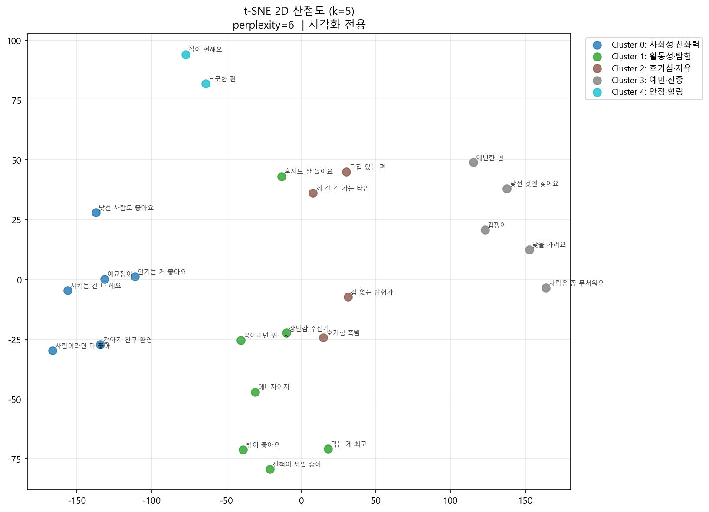
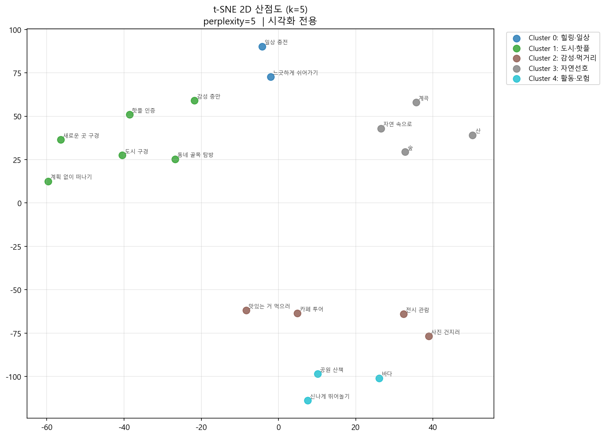
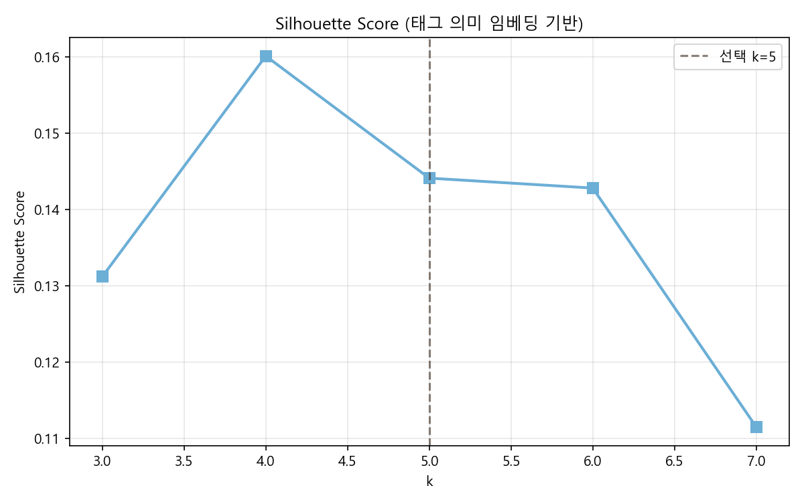
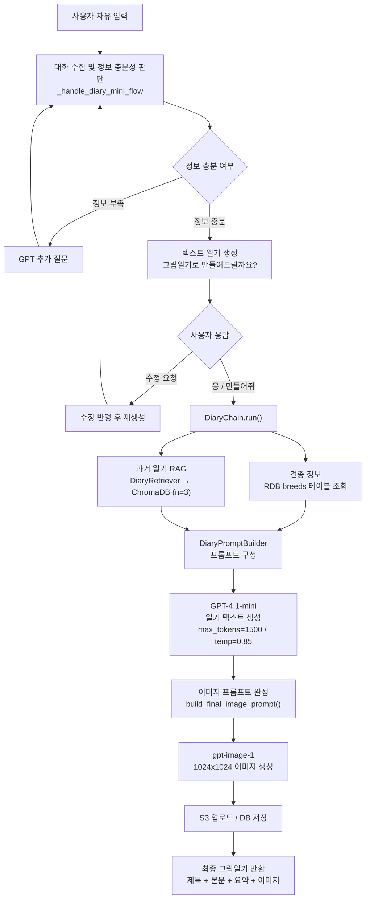
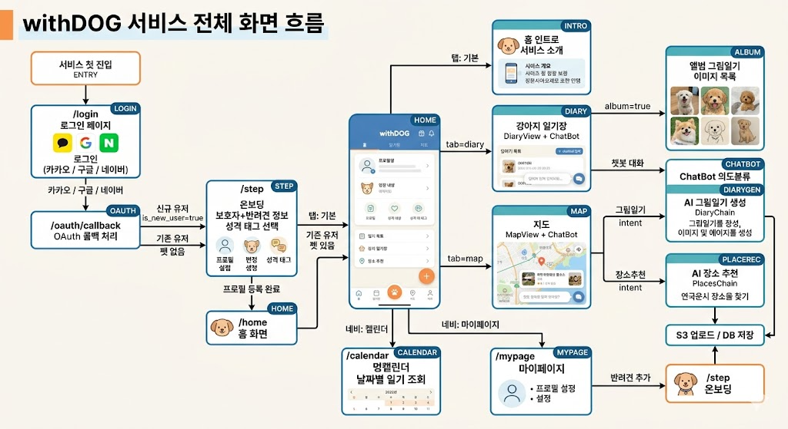
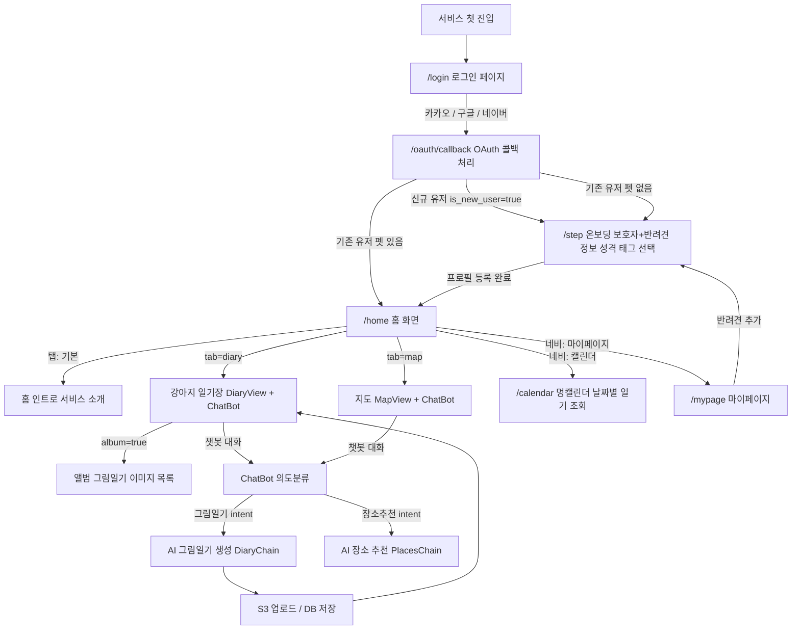
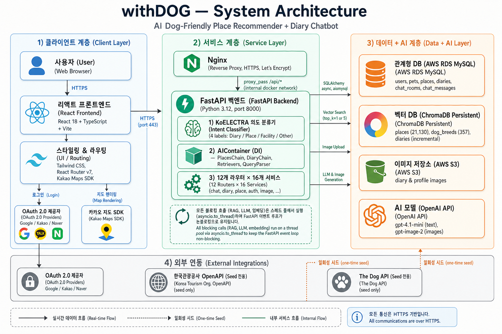
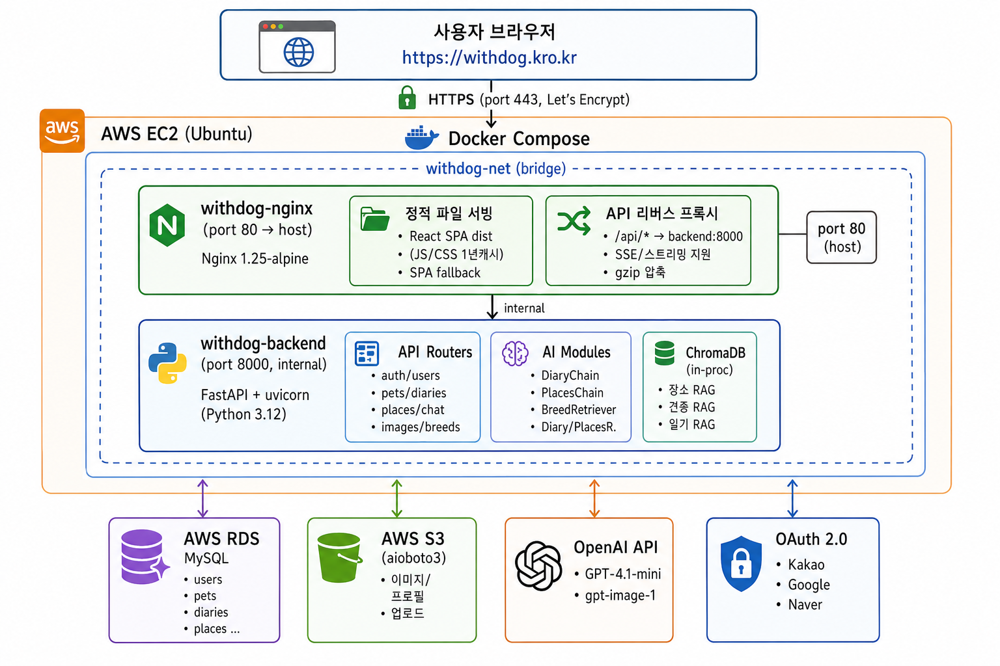
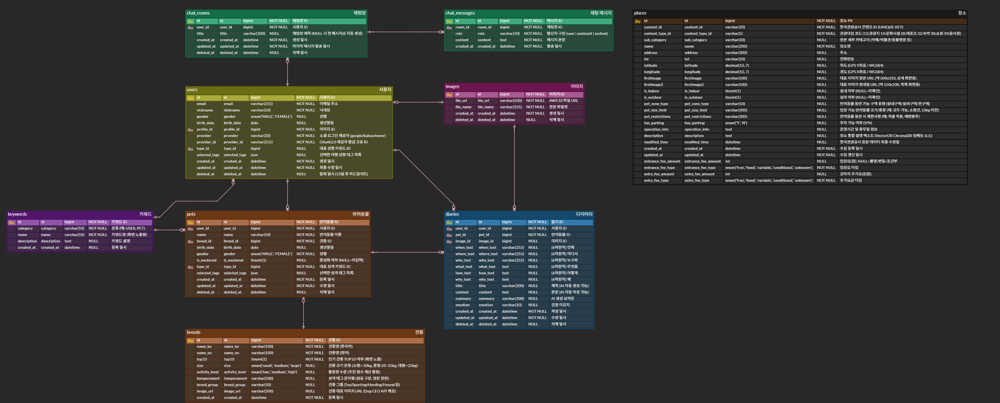

# Team. 케르베로스

<div align="center">

  

  <table style="width:100%; max-width:1100px; text-align:center; border-collapse:collapse;">
    <colgroup>
      <col style="width: 15%;" />
      <col style="width: 15%;" />
      <col style="width: 15%;" />
    </colgroup>
    <tr>
      <td style="text-align:center;">이승연</td>
      <td style="text-align:center;">정유선</td>
      <td style="text-align:center;">송민채</td>
    </tr>
    <tr>
      <th style="text-align:center;">APM</th>
      <th style="text-align:center;">PM</th>
      <th style="text-align:center;">AI Engineer</th>
    </tr>
    <tr>
      <td style="text-align:center;">
        서비스 기획 · 화면 설계<br/>
        프론트엔드(UX/UI)<br/>
        LLM 개발 (그림일기)<br/>
        발표
      </td>
      <td style="text-align:center;">
      계정 및 리소스 결제 관리<br/>
      서버 구축 및 관리<br/>
      RDB 설계 및 관리<br/>
      FastAPI 구축 및 백엔드 개발<br/>
      LLM (의도분류) · ML (의도분류)
      </td>
      <td style="text-align:center;">
        데이터 수집 · 정제<br/>
        벡터DB<br/>
        LLM 개발 (RAG, 장소 추천)
      </td>
    </tr>
    <tr>
      <td style="text-align:center;">
        <a href="https://github.com/OOOONBBOWQ">
          
        </a>
      </td>
      <td style="text-align:center;">
        <a href="https://github.com/JYS96">
          
        </a>
      </td>
      <td style="text-align:center;">
        <a href="https://github.com/MINCHAESONG">
          
        </a>
      </td>
    </tr>
  </table>

  <br />

  <tr>
    <td style="padding:14px; line-height:1.6;">
      서비스 기획<br/>
      화면 설계 및 구현<br/>
      프론트엔드 개발 (UX/UI/API 연동)<br/>
      챗봇 AI 그림일기 플로우 설계<br/>
      AI 그림일기 생성 파이프라인 및 프롬프트 최적화<br/>
      S3 이미지 저장 연동<br/>
      발표 자료 제작 및 발표<br/>
    </td>
    <td style="padding:14px; line-height:1.6;">
    계정 및 리소스 결제 관리<br/>
    서버 구축 및 관리<br/>
    RDB 설계 및 관리<br/>
    FastAPI 구축 및 백엔드 개발<br/>
    LLM (의도분류) · ML (의도분류)
    </td>
    <td style="padding:14px; line-height:1.6;">
      데이터 수집 · 정제<br/>
      벡터DB<br/>
      LLM 개발 (RAG, 장소 추천)
    </td>
  </tr>

  <br />

  

  <br />

</div>

# 1. 프로젝트 개요

###  withDOG, 강아지와  더 잘 놀고 더 잘 기억하기

withDOG는 반려견 동반 장소를 추천하고 실행부터 기록까지 하나의 흐름으로 연결하는 AI 기반 통합 서비스입니다.

반려동물 양육 가구가 늘며 반려견을 동반한 장소 방문, 여행 수요는 커지고 있지만,
현재 시장은 정보가 분산되어 있고 반려견 성향이나 보호자 라이프스타일을 반영한
개인화 추천 서비스는 부족합니다.

withDOG는 탐색부터 기록까지의 경험을 하나로 이어, 반려견과의 시간을 더 쉽고 감성적으로 남길 수 있도록 합니다.

---

# 2. 프로젝트 배경 및 목적

**국내 반려동물 양육 가구 비율은 약 30%에 달하며, 반려동물을 가족으로 여기는 '펫팸족' 문화가 확산**되고 있습니다.


이와 함께 반려견과 함께 방문할 수 있는 카페, 공원, 식당, 실내 공간 등에 대한 수요도 빠르게 증가하고 있습니다.
조선일보(2025.10.17)는 반려동물 동반 외출·관광 수요가 확대되면서 관련 장소와 인프라가 새로운 생활·관광 시장으로 주목받고 있다고 보도한 바 있다.
정부 역시 농림축산식품부 「제3차 동물복지 종합계획(2025~2029)」을 통해 **반려동물 친화 공간과 관련 인프라 확대를 추진** 중입니다.

그러나 **사용자가 실제로 반려견과 방문할 장소를 찾는 과정에서는 여전히 불편함이 존재**합니다.

한국관광공사의 「2024 반려동물 동반여행 현황 및 인식조사」에 따르면, 반려동물 동반 시 주요 장애 요인으로 숙박시설 부족 46.4%, 음식점·카페 부족 44.8%, 관광지 부족 35.7%가 제시되었다. 즉, 사용자는 반려견과 함께 갈 수 있는 장소 자체가 충분하지 않다고 느끼며, 동반 가능 여부와 이용 조건을 직접 확인해야 하는 탐색 부담을 겪고 있습니다.

따라서 **WithDOG**는 단순 추천 서비스가 아니라,
반려견의 성향과 보호자의 상황을 반영하여 일상 속 산책, 외출, 카페 방문, 실내 놀이 공간 등 다양한 반려견 동반 장소를 추천하는 AI 기반 장소 추천 서비스를 지향합니다.

---

<div align="center">

# 3. 수집 데이터 및 전처리

</div>

## 3.1. 데이터 출처 및 수집 방식

  | 데이터 | 출처 | 수집 방식 |
  |--------|------|-----------|
  | 반려동물 동반 가능 장소 | 한국문화정보원 공공데이터 포털 | CSV 다운로드 |
  | 견종 정보 | The Dog API | REST API 호출 |

- **장소 데이터**: `한국문화정보원_전국_반려동물_동반_가능_문화시설_위
치_데이터_20250324.csv` 기준
  전체 70,650건에서 반려동물 동반 가능 장소만 필터링
- **견종 데이터**: The Dog API에서 견종 정보 수집 후 GPT-4.1-mini로
한국어 번역, 국내 인기 TOP 10 마킹

## 3.2. 데이터 전처리 파이프라인
> #### 데이터 전처리 과정

  ```
  원본 CSV (70,650건)
    ↓ 반려동물 동반 가능(Y) 필터링
    ↓ 한반도 위경도 범위 검증 (위도 33~38.7, 경도 124~132)
    ↓ 필수 필드 누락 제거 (시설명, 주소)
    ↓ 중복 제거 (시설명 + 주소 기준)
    ↓ 카테고리 매핑 → sub_category, content_type_id
    ↓ 실내/실외 여부, 펫존 유형 변환
    ↓ content_id 생성 (name + address MD5 해시)
    ↓ 자연어 description 문장 생성 (벡터화용)
    ↓ 입장료 / 추가요금 정규화 (description → entrance_fee_* / extra_fee_* 4 컬럼)
    ↓
    ├── MySQL DB 적재 (배치 1,000건 단위)
    └── ChromaDB 벡터화 적재 (ko-sroberta-multitask, 배치 50건 단위)
  ```
    ▎ 최종 유효 장소: 21,130건 (2026-04-27 측정)

> #### 주요 전처리 시스템 및 스키마

  **벡터화용 description 문장 예시**

  "[장소명]은 서울특별시에 위치한 카페 장소로 반려견 동반이 가능하다.
  입장 가능 크기: 소형견. 이용 조건: 목줄 착용 필수.
  실내 이용 가능. 주차 가능. 운영시간: 10:00~21:00. 휴무일: 월요일."

  **Place DB 주요 스키마**

    | 필드 | 설명 |
    |------|------|
    | `content_id` | name + address MD5 해시 (고유 식별자) |
    | `name` / `address` | 장소명 / 주소 |
    | `sub_category` | 세부 카테고리 (카페, 공원, 동물병원 등) |
    | `is_indoor` / `is_outdoor` | 실내/실외 가능 여부 |
    | `pet_zone_type` | 반려동물 구역 유형 (실내구역/실외구역/전구역) |
    | `pet_size_limit` | 입장 가능 크기 제한 |
    | `pet_restrictions` | 이용 제한사항 |
    | `has_parking` | 주차 가능 여부 (Y/N) |
    | `operation_info` | 운영시간 및 휴무일 |
    | `description` | ChromaDB 벡터화 소스 텍스트 |

## 3.3. 수집 데이터 현황
> #### 태그별 수집 개수

  | sub_category | content_type_id | 설명 |
  |--------------|-----------------|------|
  | 카페 | 39 | 반려견 동반 카페 |
  | 식당 | 39 | 반려동물 동반 음식점 |
  | 펜션 | 32 | 반려견 동반 숙박 |
  | 호텔 | 32 | 반려견 동반 호텔 |
  | 공원 | 12 | 반려견 입장 가능 공원 |
  | 관광지 | 12 | 반려견 동반 관광지 |
  | 반려견놀이터 | 28 | 반려견 전용 놀이터 |
  | 박물관 / 미술관 / 문예회관 | 12 | 반려견 동반 문화시설 |
  | 동물병원 / 동물약국 | 14 | 동물 의료시설 |
  | 반려동물용품 | 38 | 반려동물 용품점 |
  | 미용 / 위탁관리 | 14 | 반려동물 케어 시설 |


  **최종 적재 현황**

  - MySQL DB: 21,130건
  - ChromaDB 벡터: 21,130건 (컬렉션명: dog_places)

  **카테고리별 적재 분포**

  | sub_category | 건수 |
  |--------------|------:|
  | 동물약국 | 8,440 |
  | 동물병원 | 4,486 |
  | 반려동물용품 | 3,821 |
  | 미용 / 위탁관리 | 2,003 |
  | 카페 | 801 |
  | 펜션 | 407 |
  | 기타 | 1,172 |

---

<div align="center">

  # 4. 서비스 기능 및 모델/파이프라인 설계

  <p align="center">
    
    
    
    
  </p>

</div>

  | 기능 | 설명 | 핵심 기술 |
  | --- | --- | --- |
  | 1. 챗봇 의도분류 | 사용자 입력을 분석해 다이어리 작성, 장소추천, 시설정보, 기타 응답으로 라우팅합니다. | KoELECTRA Fine-tuning, FastAPI, Intent Routing |
  | 2. 반려견과 보호자 성향 분석 | 온보딩에서 선택한 반려견·보호자 태그를 각각 5축 점수로 수치화하여 성향을 분석하고, 태그 텍스트 임베딩 기반 KMeans 군집화를 통해 비슷한 의미의 태그가 가까운 그룹으로 묶이는지 확인합니다. 이를 통해 성향 축 정의가 임의적이지 않음을 설명하는 근거로 활용합니다. | DogScorer, OwnerScorer, 태그 기반 벡터 점수화, Sentence-Transformers, KMeans, PCA, t-SNE |
  | 3. AI 장소 추천 | 사용자 검색어, 반려견 성향, 보호자 취향, 장소 특성을 결합해 반려견 동반 가능 장소를 개인화 추천합니다. | ChromaDB 벡터 검색, 코사인 유사도, 룰 기반 점수, 카카오 지도 API |
  | 4. AI 그림일기 | 챗봇 대화를 바탕으로 텍스트 일기와 동화책 스타일 이미지를 생성하고 저장합니다. | GPT-4.1-mini, gpt-image-1, ChromaDB RAG, S3 |

<br />

## 4.1. 챗봇 의도분류 모델

챗봇에 입력된 텍스트를 의도 분류 모델로 분석한 뒤, 각 기능에 맞는 처리 흐름으로 라우팅합니다.

| 항목 | 내용 |
| --- | --- |
| 베이스 모델 | `monologg/koelectra-base-v3-discriminator` |
| 분류 클래스 | 다이어리 작성 / 장소추천 / 시설정보 / 기타 |
| 학습 설정 | epochs=5, batch=16, lr=3e-5, max_length=128 |
| 평가 지표 | Accuracy, Classification Report, per-class F1 |
| 학습 결과 | **Accuracy 0.9848** (488 샘플, 5 epoch — 출처: `학습.txt`, gitignore 처리) |
| 모델 저장 | `ai/intent/model/` |
| 서비스 구조 | 메인 FastAPI 서버와 별도 포트에서 의도 분류 API 실행 |

> #### 의도 분류 흐름

```text
사용자 입력
    ↓
KoELECTRA Tokenizer
    ↓
KoELECTRA Sequence Classification
    ↓
Softmax → Intent Label 추론
    ↓
chat_response_service.py 라우팅
    ├─ 그림일기     → _handle_diary_mini_flow()
    ├─ 장소추천     → _handle_place_recommendation()
    ├─ 시설정보     → _handle_facility_info()
    └─ 기타         → 일반 GPT 응답
```

> #### 의도별 분류모델 처리 방식

| 의도 | 처리 내용 |
| --- | --- |
| 그림일기 | 사용자 대화를 수집하고, 정보가 충분하면 텍스트 일기와 그림일기 생성으로 연결합니다. |
| 장소추천 | 사용자 검색어와 성향 정보를 기반으로 반려견 동반 장소를 추천합니다. |
| 시설정보 | 동물병원, 동물약국, 미용, 위탁관리 등 목적 기반 시설 정보를 제공합니다. |
| 기타 | 서비스 범위를 벗어난 일반 대화 또는 안내 응답을 제공합니다. |

<br />

## 4.2. 반려견과 보호자 성향 분석

온보딩에서 선택한 반려견·보호자 태그를 기반으로 각각의 성향을 5축 점수로 수치화합니다.  
이 성향 점수는 이후 장소 추천에서 반려견 적합도와 보호자 취향 적합도를 계산하는 기준으로 사용됩니다.

KMeans는 실제 추천을 수행하는 모델이 아니라,  
온보딩 태그들이 의미적으로 유사한 그룹을 형성하는지 확인하여 성향 축 정의가 임의적이지 않음을 설명하는 검증 자료로 활용됩니다.

> #### 성향분석 파이프라인

| 단계 | 내용 |
|------|------|
| ① 온보딩 | 반려견 성향 태그와 보호자 취향 태그 선택 |
| ② 반려견 점수화 | `DogScorer`로 반려견 태그를 5축 점수 벡터로 변환 |
| ③ 보호자 점수화 | `OwnerScorer`로 보호자 태그를 5축 점수 벡터로 변환 |
| ④ 대표 타입 분류 | 각 5축 중 최고점 축을 기준으로 반려견 타입과 보호자 타입 분류 |
| ⑤ 성향 검증 | 태그 텍스트 임베딩 후 KMeans 군집화로 의미 유사 그룹 확인 |
| ⑥ 추천 연동 | 산출된 성향 점수를 AI 장소 추천의 `dog_score`, `owner_score` 계산에 활용 |

> #### 성향 타입 분류 방식

```text
dog_tags
  → DogScorer.calculate_vector()
  → DogScorer.classify_type()
  → dog_type / dog_type_name

owner_tags
  → OwnerScorer.calculate_vector()
  → OwnerScorer.classify_type()
  → owner_type / owner_type_name
```

태그가 없는 경우에는 타입 분류를 생략하고, 기본 장소 검색 흐름으로 진행합니다.

> #### 성향 축 정의

**DogScorer — 반려견 성향 5축**

| 축 | 의미 | 태그 예시 |
|----|------|-----------|
| dog_a | 활동성·탐험 | 에너자이저, 산책이 제일 좋아 |
| dog_b | 사회성·친화력 | 애교쟁이, 강아지 친구 환영 |
| dog_c | 안정·실내 선호 | 느긋한 편, 집이 편해요 |
| dog_d | 호기심·자유로움 | 겁 없는 탐험가, 호기심 폭발 |
| dog_e | 예민함·신중함 | 낯을 가려요, 예민한 편 |

**OwnerScorer — 보호자 취향 5축**

| 축 | 의미 | 태그 예시 |
|----|------|-----------|
| owner_a | 자연 선호 | 산, 숲, 계곡 |
| owner_b | 도시·핫플 선호 | 핫플 인증, 새로운 곳 구경 |
| owner_c | 활동성 선호 | 공원 산책, 신나게 뛰어놀기 |
| owner_d | 감성·느긋함 선호 | 감성 충만, 느긋하게 쉬어가기 |
| owner_e | 먹거리·일상 선호 | 카페 투어, 맛있는 거 먹으러 |

> #### KMeans 활용 방식

KMeans는 추천의 정답을 만드는 모델이 아니라,  
성향 축 정의의 설명력을 보완하는 검증 자료입니다.

| 구성 요소 | 역할 |
|-----------|------|
| `DogScorer` / `OwnerScorer` | 사용자 성향 점수 계산 기준 |
| KMeans | 온보딩 태그의 의미적 유사 그룹 형성 여부 검증 |
| PCA / t-SNE | 태그 군집 결과 시각화 |

예를 들어 `에너자이저`, `산책이 제일 좋아`, `밖이 좋아요`와 같은 태그가 임베딩 공간에서 가까운 군집으로 묶이면,  
이 태그들을 `dog_a: 활동성·탐험` 축에 배치한 근거로 활용할 수 있습니다.

성향 검증은 태그 이름과 설명 문장을 임베딩한 뒤 KMeans 군집화를 수행하고, 그 결과를 PCA / t-SNE로 2차원 시각화하는 방식으로 진행했습니다.  
이 분석의 목적은 추천 성능을 직접 높이는 것이 아니라, `DogScorer` / `OwnerScorer`의 5축 정의가 임의적인 수기 분류가 아니라 태그 의미 구조와도 어느 정도 일치하는지를 확인하는 데 있습니다.

Silhouette score만 보면 dog / owner 모두 `k=4`에서 가장 높게 나왔지만, 최종 문서화와 성향 축 해석의 일관성을 위해 `FINAL_K = 5` 기준 결과도 함께 검토했습니다.

> #### KMeans 시각화 결과

**Dog tag t-SNE (3rd test)**



반려견 태그는 활동형, 사회성 중심, 신중·예민 성향처럼 의미가 가까운 항목들이 서로 인접한 군집으로 모이는 경향을 보였습니다.  
이는 `DogScorer`의 5축이 실제 태그 의미 분포와 완전히 무관하게 정의된 것이 아님을 보여주는 보조 근거로 해석할 수 있습니다.

**Owner tag t-SNE (3rd test)**



보호자 태그 역시 자연 선호, 도시 탐방, 감성·휴식, 먹거리 중심 취향처럼 유사 의미 태그들이 가까운 위치에 배치되는 패턴을 보였습니다.  
따라서 `OwnerScorer`의 축 정의 역시 온보딩 태그의 의미 구조와 일정 부분 정합성이 있다고 설명할 수 있습니다.

**Silhouette score**



정량 지표 측면에서는 군집 수에 따라 분리도가 어떻게 변하는지 함께 확인했으며, 시각화 결과와 축 해석 가능성을 함께 고려해 최종 군집 구성을 해석했습니다.

<br />

## 4.3. AI 장소 추천

AI 장소 추천은 사용자 검색어, 반려견 성향, 보호자 취향, 장소 메타데이터를 함께 반영해 반려견 동반 가능 장소를 추천하는 기능입니다.

사용자 입력은 먼저 KoELECTRA 의도분류 모델을 거쳐 `장소추천` 의도로 분류되며, 이후 `chat_response_service._handle_places()` 경로에서 하이브리드 장소 검색과 성향 기반 재정렬을 수행합니다. `PlacesChain`의 재정렬 규칙은 이 경로에서 공통으로 재사용됩니다.

> #### 장소추천 파이프라인

```text
사용자 자유 입력
    ↓
KoELECTRA 의도분류
    ↓
장소추천 intent
    ↓
chat_response_service._handle_places()
    ↓
QueryParser 조건 파싱
    ↓
RDB 후보 필터링 / 위치 기반 반경 후보 생성
    ↓
ChromaDB 의미 검색
일반 질문: 자유 검색
근처·GPS 질문: 반경 후보 안 재순위
    ↓
rule_score + rag_score 결합
    ↓
후보 최대 20개 확보
    ↓
반려견/보호자 성향 기반 재순위
    ↓
상위 5개 선택
    ↓
GPT-4.1-mini 추천 메시지 생성
    ↓
장소 메타데이터 병합
    ↓
프론트 반환
```

> #### Step 1 — 성향 타입 분류

장소 추천 요청이 들어오면 사용자의 온보딩 태그를 기반으로 반려견 타입과 보호자 타입을 분류합니다.

```text
dog_tags
  → DogScorer.classify_type()
  → dog_type
  → a ~ e 축 점수 중 최고점 축을 타입 ID로 매핑

owner_tags
  → OwnerScorer.classify_type()
  → owner_type
  → a ~ e 축 점수 중 최고점 축을 타입 ID로 매핑
```

태그가 없는 경우에는 타입 분류 없이 `None`으로 처리하고 추천을 진행합니다.

> #### Step 2 — 쿼리 파싱 및 RDB 후보 필터링

```text
사용자 입력
  → QueryParser
  → objective 조건 추출
      - 지역 / 장소유형 / 실내외 / 주차 / 시간 / GPS / landmark
  → subjective 조건 추출
      - 조용한 / 넓은 / 분위기 좋은 / 산책하기 좋은 등
  → RDB 후보 필터링
```

RDB 후보 필터링은 SQL 조건 기반으로 후보를 좁히는 단계입니다. 6차 평가 이후 기본 후보 상한을 500개로 확대했고, 장소 유형 텍스트 필터 결과가 5개 미만이면 원본 후보를 유지해 과도한 후보 손실을 방지합니다. `근처`, `주변`, `내 주변`처럼 위치가 핵심인 질문은 1km → 2km → 3km 순으로 반경을 넓혀 거리 후보를 먼저 만들고, 이후 검색도 이 후보 안에서 재정렬합니다.

> #### Step 3 — ChromaDB 의미 검색

사용자 검색 쿼리를 임베딩한 뒤 ChromaDB에서 의미적으로 가까운 장소를 검색합니다. `subjective` 조건이 있으면 이를 우선 사용하고, 비어 있으면 사용자 원문 전체를 사용합니다.

```text
subjective or raw_query
  → Embedder.embed()
  → query embedding
  → ChromaDB.query()
  → COLLECTION_PLACES 검색
  → 코사인 유사도 기반 places[] 반환
```

검색 시 필요한 경우 아래 조건을 함께 사용할 수 있습니다.

```text
category
city
district
```

6차 평가 이후 일반 combined 모드에서는 ChromaDB 후보를 RDB 후보 안으로 제한하지 않습니다. 따라서 객관 조건 기반 RDB 검색과 의미 기반 ChromaDB 검색이 각각 후보 품질을 보완하고, 이후 점수 계산에서 결합됩니다. 다만 `경복궁 근처`, `서울역 주변`, `내 주변`처럼 위치 의도가 핵심인 질문은 반경 후보 안에서만 ChromaDB 재순위를 수행해 거리 조건을 우선 보존합니다.

> #### Step 4 — 반려견/보호자 성향 기반 재순위

하이브리드 검색으로 가져온 장소 후보에 대해 반려견 성향과 보호자 성향을 함께 반영해 재정렬합니다. 현재 실서비스는 최종 5개를 바로 고르지 않고, 검색 단계에서 최대 20개 후보를 확보한 뒤 프로필 점수를 더해 상위 5개를 반환합니다.

```text
dog_score_vector = DogScorer.calculate_vector(dog_tags)
owner_score_vector = OwnerScorer.calculate_vector(owner_tags)

활동성 a > 3 + category=공원/놀이터  → +0.10 bonus
사회성 b > 3 + category=카페/관광지  → +0.05 bonus
예민도 e > 3 + outdoor=Y            → -0.15 penalty
예민도 e > 3 + 반려견놀이터/레포츠  → -0.15 penalty

자연 선호 a > 3 + outdoor=Y         → +0.08 bonus
도시 탐험 b > 3 + category=카페/관광지 → +0.05 bonus
여유 휴식 d > 3 + indoor=Y / 카페    → +0.05 bonus
```

```python
base_score = rag_score * 0.5 + rule_score * 0.5 + category_bias
final_score = base_score + profile_bonus
```

`dog_tags`와 `owner_tags`가 모두 없는 경우에는 이 재정렬 단계를 생략합니다.

> #### Step 5 — 추천 이유 생성

검색 및 재정렬된 최종 장소 5개를 기반으로 `chat_response_service.generate_place_reasons()` 가 GPT-4.1-mini를 호출해 장소별 추천 이유만 생성합니다. 현재 실서비스 응답 조립은 `chat_response_service` 에서 수행하고, `PlacesChain` 은 성향 재정렬 규칙을 재사용하는 역할로 남아 있습니다.

```text
최종 places[5]
  → generate_place_reasons()
  → 사용자 질문 + 후보 장소 메타데이터 전달
  → GPT-4.1-mini
  → JSON: { places[{ name, reason }] }
```

> #### Step 6 — 결과 병합 및 반환

GPT가 생성한 추천 이유와 ChromaDB/RDB 장소 메타데이터를 병합해 프론트로 반환합니다.

```json
{
  "places": [
    {
      "name": "장소명",
      "address": "주소",
      "lat": 37.0,
      "lng": 127.0,
      "category": "카페",
      "conditions": "반려견 동반 가능 조건",
      "reason": "추천 이유"
    }
  ]
}
```

> #### 추천 점수 구조

현재 장소 추천은 하이브리드 검색 단계에서 `rag_score`, `rule_score`, `category_bias`를 합산해 기본 점수를 만들고, 그 위에 반려견/보호자 성향 기반 보너스와 패널티를 더해 재정렬합니다.

```python
base_score = rag_score * 0.5 + rule_score * 0.5 + category_bias
final_score = base_score + profile_bonus
```

현재 구현은 축별 가중합을 직접 계산하기보다, 태그 점수 벡터를 규칙 기반 bonus/penalty로 반영하는 방식입니다. 필요하다면 향후에는 아래와 같이 각 요소를 명시적 가중치 구조로 확장할 수 있습니다.

```python
final_score = (
    rag_score   * 0.45  # 검색어 ↔ 장소 설명 의미 유사도
  + dog_score   * 0.25  # 반려견 성향 ↔ 장소 반려견 적합도
  + owner_score * 0.20  # 보호자 취향 ↔ 장소 보호자 적합도
  + rule_score  * 0.10  # 동반 가능 여부, 실내외 조건 등 명시 규칙
)
```

> #### 장소 카테고리 분류

| 추천 유형 | 포함 카테고리 |
|-----------|---------------|
| 공원·산책 | 공원, 관광지, 여행지 |
| 반려견놀이터 | 반려견놀이터 |
| 카페·식당 | 카페, 식당 |
| 숙소 | 펜션, 호텔 |
| 문화공간 | 문예회관, 미술관, 박물관 |
| 목적 기반 검색 | 동물병원, 동물약국, 미용, 위탁관리, 반려동물용품 |

목적 기반 카테고리는 성향 추천 대상에서 제외하고, 사용자의 명시적 검색 의도가 있을 때 별도 처리합니다.

> #### 전체 흐름 요약

```text
사용자 입력
  → KoELECTRA 의도분류
  → 장소추천 intent
  → QueryParser (쿼리 → 객관 조건 분리) 
  → DogScorer / OwnerScorer 성향 타입 분류
  → RDB 후보 필터링
  → ChromaDB 의미 검색
  → rag_score / rule_score / category_bias 결합
  → 후보 최대 20개 확보
  → 반려견/보호자 성향 기반 bonus/penalty 재정렬
  → 상위 5개 선택
  → GPT-4.1-mini reason 생성
  → 장소 메타데이터 병합
  → 프론트 반환
```

<br />

## 4.4. AI 그림일기

AI 그림일기는 챗봇 대화를 바탕으로 하루의 에피소드를 텍스트 일기와 동화책 스타일 이미지로 생성하는 기능입니다.  
강아지 1인칭 시점으로 일기를 작성하고, 반려견의 견종·나이·감정·성격을 반영한 이미지 프롬프트를 자동 구성합니다.

> #### 대화 수집 및 생성 흐름



> #### DiaryChain 파이프라인 (6단계)

| 단계 | 내용 |
|------|------|
| Step 1 | 견종 정보 조회 — RDB `breeds` 테이블에서 직접 조회 (단일 출처화) |
| Step 2 | `DiaryRetriever.search(query, user_id, n_results=3)` — 유사 과거 일기 검색 |
| Step 3 | `DiaryPromptBuilder.build_diary_prompt()` — 일기 생성 프롬프트 구성 |
| Step 4 | GPT-4.1-mini 호출 — JSON 형식 일기 생성 (제목·본문·요약·이미지 힌트) |
| Step 5 | JSON 파싱 |
| Step 6 | `build_final_image_prompt()` — 견종·나이·감정·구도 규칙을 결합해 최종 이미지 프롬프트 완성 |

> #### GPT 출력 형식

```json
{
  "title": "귀엽고 짧은 제목 (15자 이내, 강아지 말투)",
  "content": "일기 본문 (400자 이상, 강아지 1인칭)",
  "summary": "한줄요약 (30자 이내, 귀엽게)",
  "image_prompt_base": "English only. One single storybook scene within 90 words."
}
```

> #### DiaryPromptBuilder — 감정·유형·견종 반영

강아지의 감정과 일기 유형, 견종 특성을 프롬프트에 자동으로 반영합니다.

**감정 이모지 → 문체 톤 (12종)**

| 감정 | 라벨 | 문체 톤 |
|------|------|---------|
| 😊 | 신나고 행복해요 | 밝고 신나고 경쾌한 톤. 짧고 통통 튀는 문장. |
| 😄 | 기분이 너무 좋아요 | 밝고 환한 톤. 활기차고 기분 좋은 하루. |
| 😂 | 너무 웃겨요 | 신나고 과장되게 즐거운 톤. 참을 수 없이 웃긴 상황. |
| 😅 | 살짝 민망했어요 | 살짝 민망하고 쑥스러운 톤. 귀엽게 당황한 느낌. |
| 🥰 | 너무 사랑스러워요 | 두근두근 설레고 사랑스러운 톤. 달달한 문장. |
| 🤍 | 사랑스럽고 애틋해요 | 다정하고 애틋한 톤. 보호자에 대한 사랑이 묻어남. |
| 😌 | 평온하고 여유로워요 | 잔잔하고 평온한 톤. 느긋하고 부드럽게 흘러가는 문장. |
| 🙂 | 그냥 만족스러워요 | 잔잔하고 만족스러운 톤. 충분히 행복한 느낌. |
| 🥹 | 뭉클하고 감동적이에요 | 감성적이고 뭉클한 톤. 여운이 남는 문장. |
| 😴 | 나른하고 피곤해요 | 나른하고 졸린 톤. 담백하고 느릿한 문장. |
| 😟 | 조금 걱정되거나 불안해요 | 살짝 걱정되고 세심한 톤. 조심스럽지만 부드럽게 마무리. |
| 😢 | 슬프고 쓸쓸해요 | 슬프고 쓸쓸한 톤. 잔잔하게 울컥하는 느낌. |

**일기 유형 → 강조 포인트 (4종)**

| 유형 | 집중 포인트 |
|------|------------|
| dog | 반려견의 행동, 컨디션, 먹은 것, 뛰어논 것 |
| owner | 보호자와의 교감, 유대감 |
| memory | 특별한 장면, 처음 경험, 여행 |
| daily | 평범하지만 소중한 일상의 안정감 |

> #### 이미지 프롬프트 완성 (`build_final_image_prompt`)

GPT가 생성한 `image_prompt_base`에 아래 요소를 결합해 최종 이미지 프롬프트를 구성합니다.

| 요소 | 내용 |
|------|------|
| 견종 시각 힌트 | `BREED_VISUAL_HINTS` — 견종별 외형 특징 명시 (30종) |
| 나이 기반 스타일 | 개월 수 기준으로 퍼피·성견·노령견 외형·비율 자동 조정 |
| 감정 무드 | 감정 이모지 → 이미지 표정·에너지 규칙으로 변환 |
| 야간 감지 | 대화 키워드 기반으로 야간 조명·분위기 자동 반영 |
| 해외 배경 감지 | 해외 지명 키워드 감지 시 현지 배경 스타일 반영 |
| 구도 규칙 | 단일 장면, 단 한 마리, 분할·패널·콜라주 금지 |
| 인물 규칙 | 동화책 스타일 얼굴, 사실적 인물 금지, 동아시아 외형 |
| 품질 규칙 | 한국·일본풍 그림책 일러스트, 구아슈+색연필 질감 |

> #### 이미지 생성 및 저장

```text
gpt-image-1
  - size    : 1024x1024
  - quality : low / medium / high (설정 가능)
  - format  : base64 (b64_json)
  → S3 업로드
  → DB 저장 (image_saved_path, diary_title, diary_content, diary_summary)
  → 앨범·캘린더에서 날짜별 조회
```

---

<div align="center">

  # 5. 화면흐름도

  

</div>

> #### 페이지 구성

| 경로 | 페이지 | 인증 필요 |
|------|--------|----------|
| `/login` | 로그인 (카카오·구글·네이버 소셜) | X |
| `/oauth/callback` | OAuth 콜백 처리 | X |
| `/step` | 온보딩 (보호자·반려견 프로필 등록) | O |
| `/home` | 홈 (인트로·일기장·지도 탭) | 일부 |
| `/calendar` | 멍캘린더 (날짜별 일기 조회) | O |
| `/mypage` | 마이페이지 (프로필·반려견 정보 관리) | O |

> #### 전체 화면 흐름



> #### 내비게이션 구조

```text
Navbar
├── 홈
│   ├── 강아지 일기장  →  /home?tab=diary
│   └── 지도           →  /home?tab=map
├── 다이어리
│   ├── 앨범           →  /home?tab=diary&album=true  (로그인 필요)
│   └── 캘린더         →  /calendar                   (로그인 필요)
├── 마이페이지         →  /mypage                     (로그인 필요)
└── 프로필 아바타 (로그인 시)
    ├── 위독 구독 패스  →  구독 안내 모달 (티어별 플랜 + 결제 버튼)
    ├── 알림 설정
    └── 로그아웃       →  /login

    로그인 버튼 (비로그인 시)  →  /login
```

> #### 비로그인 접근 처리

로그인이 필요한 메뉴(앨범·캘린더·마이페이지)에 비로그인 상태로 접근하면
로그인 유도 모달이 표시되고 소셜 로그인 페이지로 이동합니다.

<div align="center">

  ```text
  비로그인 상태 → 보호 메뉴 클릭
      ↓
  로그인 유도 모달 표시
  (앨범 모아보기 / 멍캘린더 / AI 그림일기 / AI 맞춤 추천 기능 안내)
      ↓
  로그인 하러 가기 클릭  →  /login
  ```

</div>

> #### 서비스 기능 연결 구조

<div align="center">

  ```text
  챗봇 사용자 입력
          ↓
  KoELECTRA 의도분류
          ↓
  다이어리 작성 / 장소추천 / 시설정보 / 기타 라우팅
          ↓
  온보딩 성향 분석
          ↓
  반려견·보호자 성향 점수화
          ↓
  장소 특성 점수화
          ↓
  반려견 적합도 + 보호자 취향 유사도 계산
          ↓
  개인화 장소 추천
          ↓
  방문 경험 기록
          ↓
  AI 그림일기 생성
          ↓
  앨범·캘린더 저장 및 조회
  ```

</div>

---

<div align="center">

  # 6. QA 검증 및 평가

</div>

## 6.1. 성향분석

`DogScorer` / `OwnerScorer` 의 5축 점수 정의가 임의적이지 않음을 검증하기 위해, 온보딩 태그 이름과 설명 문장을 임베딩한 뒤 KMeans 군집화를 수행했습니다.

3차 실험 결과는 `assets/kmeans/K-Means_3rd_test/` 에 정리되어 있으며, dog / owner 모두 의미가 유사한 태그들이 인접한 군집으로 모이는 경향을 확인했습니다.

정량 지표상 silhouette 최고값은 `k=4`에서 관찰되었지만, 최종 해석과 문서화는 성향 축 설명의 일관성을 고려해 `k=5` 결과도 함께 검토했습니다.

## 6.2. AI 장소 추천

장소추천 검색 품질을 정량 측정하기 위해 자동화 평가 시스템 (`ai/evaluation/`) 을 구축하고, `run_ablation.py` 로 Combined / RDB only / RAG only 성능을 비교했습니다.

> #### 평가셋 구성

| 항목 | 값 |
| --- | --- |
| 평가 파일 | `data/eval/장소추천 평가셋 NEW.xlsx` |
| 평가 건수 | 131건 |
| 평가 모드 | Combined / RDB only / RAG only |
| 카테고리 | 9종 |

카테고리 9종 — GPS 사용자 현재 위치 / 실내·실외 / 동반 조건 특수 / 편의시설(주차) / 시간 조건 / 복합 조건 / 위치 기반 근처 / 지역 × 장소유형 / 주관 형용사.

<br />

> #### 메트릭

| 메트릭 | 정의 |
| --- | --- |
| **Hit@k** | Top-k 안에 정답이 하나라도 있는 비율 (이진 0 / 1) |
| **Recall@k** | 정답이 여러 개일 때 Top-k 안에 포함된 정답 비율 (0.0 ~ 1.0) |

<br />

> #### 5차 Baseline → 6차 Final 결과

5차 baseline에서는 Combined와 RDB only가 전 구간 동일하게 나타났습니다. 이는 오류가 아니라, `subjective` 가 비어 있을 때 ChromaDB 재순위를 생략하고 RDB fallback으로 조기 반환하던 로직 때문이었습니다. 6차 final에서는 후보 수 확대, Chroma 후보 제한 완화, `subjective` empty fallback 제거, 장소 유형 필터 완화를 반영했습니다.

| 지표 | 5차 Baseline | 6차 Final | 변화 |
| --- | ---: | ---: | ---: |
| Combined Hit@1 | 26.0% | 37.4% | +11.4%p |
| Combined Hit@3 | 26.7% | 55.0% | +28.3%p |
| Combined Hit@5 | 29.0% | 62.6% | +33.6%p |
| Combined Hit@10 | 34.4% | 77.1% | +42.7%p |
| Combined Hit@20 | 55.7% | 84.0% | +28.3%p |
| Combined Recall@5 | 2.6% | 11.5% | +8.9%p |
| Combined Recall@20 | 8.6% | 35.9% | +27.3%p |

> #### 카테고리별 주요 변화 (Combined, Hit@5)

| 카테고리 | 5차 Baseline | 6차 Final | 변화 |
| --- | ---: | ---: | ---: |
| 주관 형용사 | 4.2% | 87.5% | +83.3%p |
| 지역 × 장소유형 | 12.5% | 56.3% | +43.8%p |
| 위치 기반 근처 | 20.0% | 53.3% | +33.3%p |
| 시간 조건 | 27.3% | 63.6% | +36.3%p |
| 복합 조건 | 20.7% | 41.4% | +20.7%p |
| 편의시설 (주차) | 44.4% | 55.6% | +11.2%p |
| GPS 사용자 현재 위치 | 75.0% | 75.0% | 유지 |
| 실내·실외 | 70.0% | 70.0% | 유지 |
| 동반 조건 특수 | 60.0% | 80.0% | +20.0%p |

핵심 개선 요인은 `subjective` 가 비어 있어도 원문 query로 ChromaDB 의미 검색을 수행하도록 바꾼 점입니다. 이를 통해 Combined가 RDB fallback에 머무르지 않고 RAG only 수준 이상의 성능을 보였으며, 후보 수 확대와 장소 유형 필터 완화는 보조적으로 성능을 안정화했습니다.

```bash
python ai/evaluation/run_ablation.py
```

<br />

> #### 평가 관점

| 평가 관점 | 내용 |
| --- | --- |
| 검색 의도 적합성 | 사용자 쿼리와 추천 장소가 의미적으로 관련 있는지 확인 |
| 반려견 성향 적합성 | 반려견의 활동성, 사회성, 예민함 등과 장소 특성이 맞는지 확인 |
| 보호자 취향 적합성 | 보호자의 자연 선호, 도시 선호, 먹거리 선호 등과 장소가 맞는지 확인 |
| 장소 조건 적합성 | 반려견 동반 가능 여부, 실내외 정보, 카테고리 정보가 적절한지 확인 |
| 추천 이유 품질 | 추천 사유가 사용자가 이해할 수 있게 설명되는지 확인 |

<br />

## 6.3. AI 그림일기

그림일기 QA는 생성 이미지의 품질을 점검하고, 저품질 결과를 개선하기 위한 평가 흐름입니다.  
GPT API 비전 기반 자동 평가로 전환 중이며, 현재는 수동 QA를 병행해 평가 기준을 보강하고 있습니다.

<br />

### 품질 등급

생성된 이미지는 품질 상태에 따라 `Lv0~Lv5` 등급으로 분류합니다.

| 등급 | 의미 |
| --- | --- |
| Lv0 | 생성 실패 또는 주요 피사체 인식 실패 |
| Lv1 | 저품질 이미지 |
| Lv2 | 기본 조건을 충족한 이미지 |
| Lv3 | 배경과 스타일이 안정적인 이미지 |
| Lv4 | 강아지와 사람의 상호작용이 표현된 이미지 |
| Lv5 | 서비스 적용에 적합한 완성도 높은 이미지 |

<br />

> #### QA 방식

| 구분 | 내용 |
| --- | --- |
| 자동 QA (개발 예정) | GPT API 비전 모델로 피사체 표현·배경 품질·스타일 일관성을 평가하고 Lv0~Lv5 등급으로 분류. 평가 프롬프트와 룰북을 수동 QA 결과로 보강. |
| 수동 QA | 생성 이미지를 사람이 직접 확인해 왜곡·스타일 불일치·프롬프트 누락 요소를 기록하고, 자동 QA의 평가 기준을 만드는 근거 자료로 활용. |

<br />

---

<br />

<div align="center">

  # 7. 서비스 아키텍처

  

</div>

<br />

### 전체 구성도

<div align="center">

  

</div>

<br />

> #### 요청 흐름

| 요청 유형 | 경로 |
|-----------|------|
| 페이지 접근 | 브라우저 → Nginx → React SPA (index.html) → 클라이언트 라우팅 |
| API 호출 | 브라우저 → Nginx (`/api/*`) → FastAPI 백엔드 (internal) |
| 정적 파일 | 브라우저 → Nginx (직접 서빙, 1년 캐시) |
| 이미지 업로드 | 프론트 → FastAPI → AWS S3 (aioboto3 비동기) |
| 그림일기 생성 | FastAPI → ChromaDB(RAG) → OpenAI GPT → gpt-image-1 → S3 저장 |

<br />

> #### 로컬 개발 환경

```
로컬 머신
    │
    ├─ FastAPI (uvicorn --reload, port 8000)
    │       │
    │       └─ SSH 터널 (sshtunnel + paramiko)
    │               │
    │               └─ AWS EC2 → AWS RDS MySQL (port 3306)
    │
    ├─ Vite Dev Server (port 3000)
    │       └─ /api/* → proxy → localhost:8000
    │
    └─ .env  SERVER=local  (EC2 환경에서는 SERVER=ec2)
```

- **도메인**: `https://withdog.kro.kr` (HTTPS, Let's Encrypt 인증서) → EC2 퍼블릭 IP 연결 (무료 도메인, kro.kr)  
- **컨테이너 포트**: Nginx만 `80:80` / `443:443` 외부 노출 (80 → 443 리다이렉트), 백엔드는 내부 네트워크(`withdog-net`)로만 통신

<br />

---

<div align="center">

  # 8. 데이터베이스 설계

</div>

- DBMS: AWS RDS MySQL 8.0, charset `utf8mb4_unicode_ci`, 엔진 `InnoDB`.  
- DDL 원본: `back/db/withDOG.sql`. 
- ORM 매핑: `back/api/models/`.

> #### ERD 다이어그램

<div align="center">

  

</div>

> #### 테이블 목록 (총 9개)

| 테이블 | 용도 | Soft Delete | 비고 |
| --- | --- | --- | --- |
| `users` | 소셜 로그인 사용자 | ✓ (`deleted_at`) | UNIQUE(provider, provider_id) |
| `pets` | 반려견 | ✓ | breed_id RESTRICT, type_id RESTRICT |
| `breeds` | 견종 마스터 (357종) | — | 시드 1회성 |
| `keywords` | 성향 태그 (PET / USER) | — | description = JSON 점수 벡터 |
| `chat_rooms` | 챗봇 대화 세션 | ✓ | 룸 삭제해도 메시지 보존 |
| `chat_messages` | 대화 메시지 | ✗ (영구 보존) | role: user / assistant / system |
| `diaries` | 그림일기 (6하원칙) | ✓ | image_id nullable (2-phase) |
| `images` | S3 이미지 메타 | ✓ | file_url, file_name |
| `places` | 반려견 동반 장소 (21,130건) | — | content_id UNIQUE |

<br />

> #### 관계 (ER)

```text
users 1 ─── N pets
users 1 ─── N chat_rooms ── N chat_messages
users 1 ─── N diaries N ─── 1 pets
users.profile_id ── 1 images   (RESTRICT)
diaries.image_id  ── 1 images   (RESTRICT, nullable)
pets.breed_id     ── 1 breeds   (RESTRICT)
pets.type_id      ── 1 keywords (RESTRICT, PET 카테고리)
users.type_id     ── 1 keywords (RESTRICT, USER 카테고리)
```

<br />

> #### 설계 원칙

- **Soft Delete + 10일 후 Hard Delete** — `users` / `pets` / `chat_rooms` / `diaries` / `images` 는 `deleted_at` 컬럼으로 soft delete. 모든 조회 쿼리는 `WHERE deleted_at IS NULL` 자동 추가하며, `users` 만 APScheduler 가 매일 03:00 `deleted_at < now() - 10 days` 사용자를 물리 삭제합니다.
- **2-phase 다이어리 저장** — `diaries.image_id = NULL` 로 일기 행 먼저 생성 → 이미지 생성·S3 업로드 완료 후 `PATCH` 로 바인딩. 이미지 생성 실패가 일기 본문 저장을 막지 않도록 분리.
- **chat_messages 영구 보존** — `chat_rooms` 가 soft delete 되어도 메시지는 보존됩니다 (룸 복구·학습 데이터 활용 목적).
- **이미지 RESTRICT** — `users.profile_id`, `diaries.image_id` 가 RESTRICT 로 참조되어 사용 중인 이미지는 삭제 불가.
- **인덱스 전략** — 사용자 식별 `(provider, provider_id)` UNIQUE, 룸 정렬 `(user_id, updated_at DESC)`, 메시지 정렬 `(room_id, created_at)`, 일기 필터 `(user_id, deleted_at)`, 장소 위치 `(latitude, longitude)`.

---

<div align="center">

  #  9. 디렉토리 구조

</div>

```
SKN23-FINAL-3Team/
├── front/                      # React 프론트엔드
│   └── src/app/
│       ├── pages/              # HomePage, MyPage, CalendarPage, LoginPage, Step2Page, OAuthCallbackPage
│       ├── components/         # ChatBot, ChatHistory, Navbar, MapView, DiaryView, DogProfileCard ...
│       ├── services/           # API 클라이언트 (userService, diaryService, chatService ...)
│       ├── hooks/              # useChatbot
│       └── types/              # 공통 타입 정의
│
├── back/
│   ├── main.py                 # 진입점 (back/api/main.py 로더)
│   ├── api/                    # FastAPI 백엔드
│   │   ├── main.py             # FastAPI 앱 (lifespan, 라우터 등록)
│   │   ├── routers/            # 12종 (auth, users, pets, diaries, chat-rooms, chat-messages, images, places, breeds, keywords, intent, admin)
│   │   ├── services/           # 16종 (chat_response, diary_response, chat_message, place, user, pet, diary, chat_room, image, breed, keyword, intent, auth, admin, common, scheduler)
│   │   ├── models/             # 9개 SQLAlchemy 모델
│   │   ├── schemas/            # 10개 Pydantic 스키마
│   │   └── core/               # config, database, deps, location, type
│   ├── data/scripts/           # breeds / keywords / places 시드 (2026-04-27 back/db/seeds/ 에서 이동)
│   └── db/
│       └── withDOG.sql         # MySQL DDL 덤프
│
├── ai/
│   ├── chains/                 # DiaryChain (RAG + GPT 일기 생성 파이프라인)
│   ├── prompts/                # DiaryPromptBuilder (일기·이미지 프롬프트 빌더)
│   ├── retrievers/             # BreedRetriever, DiaryRetriever, PlacesRetriever
│   ├── scorers/                # DogScorer, OwnerScorer (성향 태그 점수화)
│   ├── intent/                 # KoELECTRA 의도 분류 모델 학습·추론
│   ├── infrastructure/         # AIContainer, OpenAICostTracker, Embedder, VectorStore
│   ├── eval/                   # 이미지 품질 자동 평가 (피사체순도·배경품질·스타일일관성)
│   ├── core/                   # ChromaDB 클라이언트, 인터페이스
│   └── utils/                  # 공통 유틸리티
│
├── data/                       # 장소·견종 데이터 및 임베딩 스크립트
├── infra/docker/               # Dockerfile, docker-compose
└── requirements.txt
```

<br />

## 9.1. 주요 API 엔드포인트

| 메서드 | 경로 | 설명 |
|--------|------|------|
| GET | `/api/health` | 헬스체크 (server / db 상태) |
| POST | `/api/auth/{provider}` | 소셜 로그인 (kakao / google / naver) |
| GET | `/api/admin/token` | 개발용 무기한 JWT (`X-Admin-Key` 헤더) |
| GET | `/api/users/me` | 내 정보 조회 |
| GET | `/api/users/{id}` | 사용자 조회 |
| PATCH | `/api/users/{id}` | 유저 정보 수정 |
| DELETE | `/api/users/{id}` | 유저 soft delete (10일 후 hard delete) |
| POST | `/api/pets` | 반려견 등록 |
| GET | `/api/pets?user_id={id}` | 반려견 목록 조회 |
| GET | `/api/pets/{id}` | 반려견 상세 |
| PATCH | `/api/pets/{id}` | 반려견 수정 |
| DELETE | `/api/pets/{id}` | 반려견 soft delete |
| GET | `/api/diaries?pet_id={id}` | 일기 목록 조회 |
| POST | `/api/diaries` | 일기 생성 (image_id 없이도 생성 가능) |
| PATCH | `/api/diaries/{id}` | 일기 수정 (image_id 바인딩 포함) |
| DELETE | `/api/diaries/{id}` | 일기 soft delete |
| POST | `/api/diary/generate` | AI 일기 텍스트 생성 (GPT-4.1-mini) |
| POST | `/api/diary/generate-image` | AI 일기 이미지 생성 (gpt-image-1) |
| POST | `/api/images` | 이미지 S3 업로드 |
| DELETE | `/api/images/{id}` | 이미지 soft delete (FK RESTRICT 검증) |
| POST | `/api/chat-rooms` | 채팅방 생성 (title NULL이면 첫 메시지로 자동) |
| GET | `/api/chat-rooms?user_id={id}` | 채팅방 목록 (updated_at DESC) |
| GET | `/api/chat-rooms/{id}` | 채팅방 상세 |
| PATCH | `/api/chat-rooms/{id}/title` | 채팅방 제목 변경 |
| DELETE | `/api/chat-rooms/{id}` | 채팅방 soft delete (메시지는 보존) |
| POST | `/api/chat-rooms/{id}/messages` | 채팅 메시지 전송 (챗봇 한 턴 처리) |
| GET | `/api/chat-rooms/{id}/messages` | 채팅 메시지 조회 |
| GET | `/api/places/search?query=&category=&city=` | 장소 추천 검색 (RAG + LLM reason) |
| GET | `/api/places/{content_id}` | 장소 상세 |
| GET | `/api/breeds` | 견종 목록 조회 |
| GET | `/api/keywords?category=PET` | 강아지 성향 태그 |
| GET | `/api/keywords?category=USER` | 사용자 여행 성향 태그 |

<br />

- API 명세서 (Postman): https://documenter.getpostman.com/view/53095517/2sBXqCPipg
- 전체 API 문서 (Swagger UI): `https://withdog.kro.kr/api/docs`

<br />

## 9.2. 환경 설정

> ### 환경변수 (.env)

총 41개 키. 카테고리별로 정리된 템플릿입니다. 값은 환경별로 직접 채워 사용하세요 (`.env`는 `.gitignore` 처리됨).

```env
# ── 서버 환경 ───────────────────────────────────────────────
SERVER=               # local | ec2
APP_ENV=
DEBUG=
FRONTEND_BASE_URL=
VITE_API_URL=

# ── 데이터베이스 (AWS RDS MySQL) ────────────────────────────
DB_HOST=
DB_PORT=
DB_USER=
DB_PASSWORD=
DB_NAME=

# ── SSH 터널 (local 환경 전용) ──────────────────────────────
SSH_HOST=
SSH_PORT=
SSH_USER=
SSH_PKEY=

# ── 외부 API ────────────────────────────────────────────────
OPENAI_API_KEY=
DOG_API_KEY=          # The Dog API
TOUR_API_KEY=         # 한국관광공사 OpenAPI
KAKAO_REST_API_KEY=   # 카카오 REST API (랜드마크 좌표 조회)

# ── OAuth 2.0 (백엔드) ──────────────────────────────────────
GOOGLE_CLIENT_ID=
GOOGLE_CLIENT_SECRET=
GOOGLE_REDIRECT_URI=
KAKAO_CLIENT_ID=
KAKAO_CLIENT_SECRET=
KAKAO_REDIRECT_URI=
NAVER_CLIENT_ID=
NAVER_CLIENT_SECRET=
NAVER_REDIRECT_URI=

# ── OAuth 2.0 (프론트, Vite 노출) ───────────────────────────
VITE_GOOGLE_CLIENT_ID=
VITE_KAKAO_CLIENT_ID=
VITE_KAKAO_JAVASCRIPT_API_KEY=    # 카카오 지도 SDK
VITE_NAVER_CLIENT_ID=

# ── AWS S3 ──────────────────────────────────────────────────
AWS_ACCESS_KEY_ID=
AWS_SECRET_ACCESS_KEY=
AWS_REGION=
AWS_S3_BUCKET_NAME=

# ── 보안 ────────────────────────────────────────────────────
SECRET_KEY=           # JWT 서명 + 관리자 토큰 발급 (이중 용도)

# ── LLM / 임베딩 모델 ───────────────────────────────────────
GPT_MODEL=            # 기본 모델 ID (예: gpt-4.1-mini)
GPT_IMAGE_MODEL=      # 이미지 생성 모델 (현재 gpt-image-1)
EMBED_MODEL_NAME=     # sentence-transformers 모델

# ── Hugging Face / Transformers ────────────────────────────
HF_HUB_OFFLINE=       # 0 | 1
TRANSFORMERS_OFFLINE= # 0 | 1

# ── 기타 ────────────────────────────────────────────────────
ANONYMIZED_TELEMETRY= # ChromaDB 텔레메트리 무력화
USE_DUMMY_PLACES=     # 장소 검색 디버깅용 더미 데이터 플래그
```

<br />

---

<div align="center">

  #  10. 비즈니스 전략

</div>

Freemium 기반으로 앱 유입 → 구독 전환 → 데이터 수익까지 확장되는 다층 수익 구조입니다.

| 단계 | 모델 | 내용 |
|------|------|------|
| ① | Freemium | 무료 체험으로 서비스 진입 장벽 최소화 |
| ② | 유료 구독 1단계 | 월 10,000원 — 핵심 기능 확장 |
| ③ | 유료 구독 2단계 | 월 25,000원 — 프리미엄 전체 개방 |
| ④ | 광고/제휴 | 펫 친화 카페·숙소·용품 노출 기반 PPL, 예약 연계 패키지 |
| ⑤ | B2B 데이터 | 지역별 수요·소비 패턴 트렌드 리포트 판매 (관광사·지자체·숙박) |

---

> #### 구독 티어 상세 *(고도화 시 추가 예정)*

| 기능 | 무료 | 1단계 (10,000원/월) |  2단계 (25,000원/월) |
|------|:------:|:------:|:------:|
| 그림일기 생성 | 하루 3회 | 하루 10회 | 무제한 |
| 일기 본문 길이 | 300자 | 450자 | 500자+ 세밀한 묘사 |
| 감정 선택 | 6종 | 12종 | 12종 |
| 그림 스타일 | 기본 1종 | 3종 | 전체 5종+ |
| 그림일기 수정 | 불가 | 앱 내 일 5회 | 앱 내 일 10회 |
| 등록 반려견 수 | 2마리 | 3마리 | 무제한 |
| 월별 감정 리포트 | ✕ | O | O |
| 클라우드 백업 | ✕ | ✕ | O |
| 광고 | 있음 | 제거 | 제거 |

> 현재 MVP 단계에서는 구독 구분 없이 전체 기능을 제공합니다. 구독 시스템 및 플랜별 기능 제한은 Phase 2 모바일 앱 출시와 함께 적용될 예정입니다.

**단위 경제성**: `gpt-4.1-mini` 기반 텍스트 생성과 일일 횟수 제한으로 API 비용을 통제하며, 구독 단계가 올라갈수록 프롬프트 품질·스타일 다양성을 함께 높여 자연스러운 업그레이드 동기를 부여합니다. 향후 최신 이미지 모델 전환 시 토큰 기반 과금으로 비용 최적화가 가능합니다.

<br />

> ### 시장 기회

한국 반려동물 시장은 2023년 기준 약 **4조 5천억 원** 규모로, 2027년까지 **6조 원** 돌파가 전망됩니다. 반려동물을 가족 구성원으로 여기는 **펫팸족(Pet + Family)** 이 전체 가구의 30%를 넘어섰으며, 이들은 반려동물 관련 콘텐츠·기록·공간 탐색에 높은 지출 의향을 보입니다.

| 지표 | 수치 |
|------|------|
| 국내 반려동물 양육 가구 | 약 552만 가구 (2023, 농림축산식품부) |
| 1인당 월평균 반려동물 지출 | 약 15만 원 |
| 반려동물 앱 월간 활성 사용자(MAU) 성장률 | 연 30%↑ |
| 펫 친화 장소 등록 수요 (카카오맵 기준) | 연 40%↑ |

<br />

> ### 핵심 경쟁 우위

withDog은 단순 일기 앱이나 단순 장소 추천 앱이 아닙니다. **"기록 × 장소 × AI 개인화"** 가 결합된 점이 차별점입니다.

| 경쟁 요소 | 일반 일기 앱 | 일반 장소 앱 | **withDog** |
|-----------|------------|------------|------------|
| AI 그림일기 자동 생성 | ✕ | ✕ | ✅ 12가지 감정 반영 |
| 반려견 성향 기반 장소 추천 | ✕ | ✕ | ✅ 개성향 태그 매칭 |
| 장소 → 일기 자동 연동 | ✕ | ✕ | ✅ where_text 저장 |
| 견종·나이별 이미지 자동 생성 | ✕ | ✕ | ✅ 30종 시각 힌트 |
| 감정 기반 캘린더 시각화 | ✕ | ✕ | ✅ 이모지 달력 |
| 반려동물 성향 데이터 누적 | ✕ | ✕ | ✅ 행동·선호 패턴 |

> 경쟁 앱(포동이·강쥐일기·펫로그 등)은 단순 텍스트 기록 또는 커뮤니티 중심이며, **AI 생성 그림일기 + 개인화 장소 추천의 결합**은 국내 시장에서 유일한 포지셔닝입니다.

<br />

> ### 성장 플라이휠

사용자가 늘수록 데이터 품질이 올라가고, 데이터 품질이 올라갈수록 추천 정확도가 높아져 사용자가 더 모이는 **자기 강화 구조**입니다.


```
그림일기 기록 증가
      ↓
반려견 감정·행동 데이터 누적
      ↓
장소 추천 개인화 정확도 향상
      ↓
장소 방문 → 일기 기록 → 재방문 유도
      ↓
유저 Lock-in (기록이 쌓일수록 이탈 어려움)
      ↓
구독 전환율 상승 & 입소문 확산
```

<br />

> ### 파트너십 & 제휴 전략

withDog의 **장소 추천 + 방문 기록 연동** 기능은 오프라인 비즈니스와의 직접 연결 고리가 됩니다.

| 파트너 유형 | 제휴 방식 | 기대 효과 |
|------------|----------|----------|
| 펫 친화 카페·레스토랑 | 앱 내 장소 우선 노출 + 방문 기록 뱃지 | 신규 고객 유입, 재방문 동기 |
| 애견 동반 숙소·호텔 | 여행 일기 패키지 + 예약 연계 | 예약 수수료 수익 |
| 동물병원·펫샵 | 건강 기록 연동 + 쿠폰 발행 | B2B SaaS 구독 |
| 지자체·관광공사 | 펫 친화 여행 코스 공동 개발 | 공공 데이터 제휴 |

<br />

> ### 장기 확장 로드맵

| 시기 | 목표 | 핵심 기능 |
|------|------|----------|
| **Phase 1** (현재) | MVP 검증 · 초기 유저 확보 | AI 그림일기, 장소 추천, 감정 캘린더 |
| **Phase 2** (6개월) | 모바일 앱 출시 · MAU 1만 | 푸시 알림, 소셜 공유, 오프라인 파트너 연동 |
| **Phase 3** (1년) | 구독 전환 가속 · B2B 진입 | 건강 기록 연동, 트렌드 리포트 판매, API 제공 |

<br />

<div align="center">

  #  11. 기술 스택

</div>

> ### Backend

| 분류 | 기술 |
|------|------|
| Framework |  |
| ORM |   |
| Database |   |
| Auth |   |
| Storage |   |
| Scheduler |  |

> ### AI / ML

| 분류 | 기술 |
|------|------|
| 텍스트 일기 생성 |  |
| 이미지 생성 |  |
| 의도 분류 |   |
| 임베딩 |   |
| Vector DB |   |
| 군집·시각화 |     |
| 이미지 평가 (예정) |  |

> ### Frontend

| 분류 | 기술 |
|------|------|
| Framework |   |
| Build |  |
| Styling |  |
| Router |  |
| Animation |  |
| UI |   |
| Map |  |
| Design |    |

> ### Infra

| 분류 | 기술 |
|------|------|
| Cloud |    |
| Container |  |
| Web Server |  |
| Domain |  |
| 터널링 |    |

> ### External API

| 분류 | 기술 |
|------|------|
| LLM / 이미지 |  |
| 견종 데이터 |  |
| 관광 데이터 |  |
| 지도·좌표 |   |
| 소셜 로그인 |    |

<br />

<!-- 최종 발표떄 추가
---

<div align="center">

  # 회고

</div>

> 정유선 <br>
> ...

> 이승연 <br>
> ...

> 송민채 <br>
> ... 

-->
