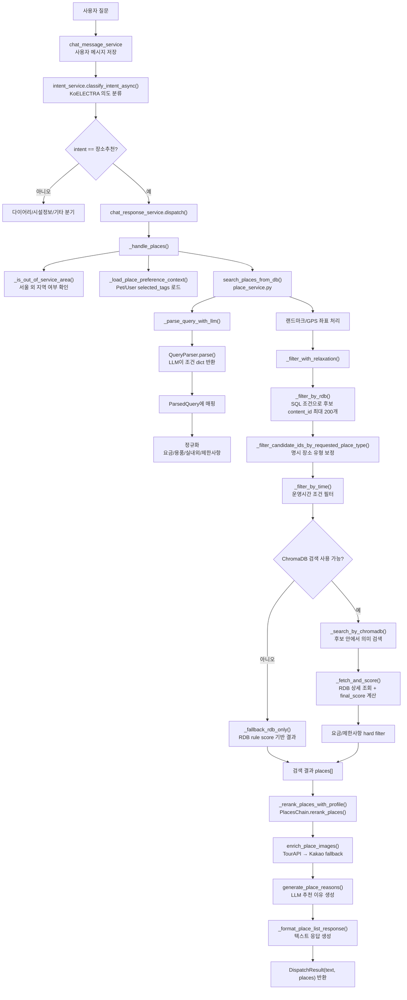

# 장소추천 로직 상세 정리

이 문서는 withDOG 챗봇의 `장소추천` 의도가 들어왔을 때, 사용자 질문이 최종 장소 카드 응답으로 변환되는 과정을 코드 기준으로 정리한 이해용 문서입니다.

발표/보고서에는 전체 흐름도와 핵심 함수만 축약해서 사용하고, 구현 검토나 리팩터링 때는 이 문서를 기준으로 세부 로직을 확인합니다.

---

## 1. 한 줄 요약

장소추천은 다음 순서로 동작합니다.

> 사용자 질문 → 의도 분류 → 장소추천 핸들러 → 프로필 태그 로드 → LLM 쿼리 파싱 → RDB 후보 필터링 → ChromaDB 의미 검색 → 점수 계산 → 프로필 리랭킹 → 이미지/추천 이유 생성 → 응답 반환

핵심 구현 파일은 다음과 같습니다.

| 파일 | 역할 |
| --- | --- |
| `back/api/services/chat_message_service.py` | 사용자 메시지 저장, 의도 분류 호출, dispatch 진입 |
| `back/api/services/intent_service.py` | KoELECTRA 기반 의도 분류 |
| `back/api/services/chat_response_service.py` | 의도별 라우팅, 장소추천 최종 응답 조립 |
| `back/api/services/place_service.py` | 장소 검색 핵심 로직: 파싱, RDB 필터, ChromaDB 검색, 점수 계산 |
| `ai/retrievers/query_parser.py` | LLM으로 사용자 질문을 구조화된 검색 조건으로 변환 |
| `ai/chains/places_chain.py` | 강아지/보호자 태그 기반 프로필 리랭킹 |
| `back/api/services/place_image_service.py` | 장소 이미지 URL 첨부 |

---

## 2. 전체 흐름도



---

## 3. 단계별 설명

### 3.1 의도 분류

진입점은 `chat_message_service.py` 입니다.

1. 사용자 메시지를 DB에 저장합니다.
2. `intent_service.classify_intent_async(data.content)` 를 호출합니다.
3. KoELECTRA 모델이 `다이어리 작성`, `장소추천`, `시설정보`, `기타` 중 하나로 분류합니다.
4. 의도 결과와 사용자 컨텍스트를 `chat_response_service.dispatch()` 로 넘깁니다.

의도 분류 실패 시에는 `unknown` intent를 만들되, strategy는 장소추천 전략을 넣습니다. 이후 `dispatch()` 에서 알 수 없는 의도는 fallback으로 처리됩니다.

### 3.2 dispatch 라우팅

`chat_response_service.dispatch()` 는 의도별 핸들러를 선택합니다.

| 의도 | 호출 함수 |
| --- | --- |
| `다이어리 작성` | `handle_diary_response()` |
| `장소추천` | `_handle_places()` |
| `시설정보` | `_handle_facility()` |
| `기타` 또는 미지원 의도 | `_handle_fallback()` |

장소추천 의도일 때는 `top_k = intent_result.strategy.get("top_k", 5)` 를 사용합니다. 현재 `intent_service.RAG_STRATEGY_MAP["장소추천"]["top_k"]` 는 5입니다.

### 3.3 장소추천 핸들러

`_handle_places(query, ctx, top_k, request)` 가 장소추천 응답을 조립하는 중심 함수입니다.

처리 순서:

1. `_is_out_of_service_area()` 로 서울 외 지역 요청인지 확인합니다.
2. `_load_place_preference_context()` 로 강아지 태그와 보호자 태그를 로드합니다.
3. `settings.USE_DUMMY_PLACES` 가 켜져 있으면 더미 장소를 반환합니다.
4. DB 세션이 있으면 `search_places_from_db()` 로 실제 장소 검색을 수행합니다.
5. `_rerank_places_with_profile()` 로 프로필 기반 리랭킹을 적용합니다.
6. `enrich_place_images()` 로 장소 이미지 URL을 붙입니다.
7. `generate_place_reasons()` 로 장소별 추천 이유를 생성합니다.
8. `_format_place_list_response()` 로 챗봇 본문 텍스트를 만듭니다.

---

## 4. 쿼리 파싱

### 4.1 ParsedQuery 구조

`place_service.ParsedQuery` 는 검색 조건을 담는 컨테이너입니다.

| 필드 | 설명 |
| --- | --- |
| `raw_query` | 사용자 원문 질문 |
| `objective.city` | 도시. 기본값은 `서울특별시` |
| `objective.district` | 구/군 단위 지역 |
| `objective.sub_category` | 카페, 식당, 공원, 반려견놀이터 등 |
| `objective.is_indoor` | 실내 조건 |
| `objective.is_outdoor` | 실외 조건 |
| `objective.has_parking` | 주차 가능 여부 |
| `objective.pet_zone_type` | 전구역/실내구역/실외구역 |
| `objective.pet_size_limit` | 소형/중형/대형견 제한 |
| `objective.entrance_fee_preference` | 입장료 무료 조건 |
| `objective.extra_fee_preference` | 반려견 추가요금 없음 조건 |
| `objective.waste_bag_preference` | 배변봉투 제공 또는 불필요 조건 |
| `subjective` | 분위기/특성 등 의미 검색용 텍스트 |
| `time_condition` | 주말, 공휴일, 연중무휴, 24시간 등 |
| `use_current_location` | 현재 위치 기준 검색 여부 |
| `landmark` | 경복궁, 강남역 같은 기준 장소 |
| `landmark_coords` | 랜드마크 또는 GPS 좌표 |

### 4.2 LLM 파싱 흐름

`_parse_query_with_llm()` 는 내부에서 `QueryParser.parse()` 를 호출합니다.

```text
사용자 query
  → QueryParser.parse()
  → OpenAI Chat Completions 호출
  → JSON 문자열 반환
  → json.loads()
  → dict 반환
  → ParsedQuery.objective / subjective / time_condition 등에 매핑
```

`QueryParser` 프롬프트는 `ai/retrievers/query_parser.py` 의 `_PARSE_SYSTEM` 에 정의되어 있습니다. 이 프롬프트는 사용자 질문을 다음 두 종류로 나눕니다.

| 구분 | 용도 | 예시 |
| --- | --- | --- |
| 객관 조건 | RDB SQL 필터에 사용 | 지역, 카테고리, 실내외, 주차, 견종 크기, 요금 |
| 주관 조건 | ChromaDB 의미 검색에 사용 | 조용한, 넓은, 뷰 좋은, 목줄 없이 가능한 |

### 4.3 파싱 후 정규화

LLM 결과를 그대로 쓰지 않고, `place_service.py` 에서 한 번 더 보정합니다.

| 함수 | 역할 |
| --- | --- |
| `_normalize_size_interpretation()` | "대형 카페"처럼 장소 크기를 말한 경우 `pet_size_limit` 에 잘못 들어가지 않도록 보정 |
| `_normalize_fee_preferences()` | 무료/추가요금 없음 표현을 구조화된 요금 조건으로 변환 |
| `_normalize_supply_preferences()` | 배변봉투 관련 표현을 `waste_bag_preference` 로 변환 |
| `_relax_objective_for_restriction_focus()` | 목줄/배변봉투처럼 제한사항 중심 질문에서 과도한 카테고리 조건을 완화 |
| `_normalize_indoor_outdoor_subjective()` | 실내/실외 조건을 `subjective` 에도 주입해 벡터 검색 품질 보강 |

---

## 5. RDB 후보 필터링

### 5.1 기본 필터

`_filter_by_rdb(parsed, db, max_candidates=200)` 는 `ParsedQuery.objective` 를 SQL 조건으로 변환합니다.

적용 조건:

| ParsedQuery 조건 | DB 필드 |
| --- | --- |
| `city` | `PlaceModel.address LIKE %city%` |
| `district` | `PlaceModel.address LIKE %district%` |
| `sub_category` | `PlaceModel.sub_category == sub_category` |
| `is_indoor` | `PlaceModel.is_indoor == is_indoor` |
| `is_outdoor` | `PlaceModel.is_outdoor == is_outdoor` |
| `has_parking` | `PlaceModel.has_parking == has_parking` |
| `pet_zone_type` | `PlaceModel.pet_zone_type == pet_zone_type` |
| `pet_size_limit` | `PlaceModel.pet_size_limit LIKE %size%` |
| `waste_bag_preference` | 배변봉투 필수 장소 제외 |
| `landmark_coords` | `ST_Distance_Sphere()` 반경 검색 |

랜드마크 좌표가 있으면 반경을 `1000m → 2000m → 3000m` 순서로 넓히며, 최소 3개 후보를 찾거나 마지막 반경에 도달하면 중단합니다.

### 5.2 필터 완화

`_filter_with_relaxation()` 은 RDB 필터 결과가 0건일 때 조건을 단계적으로 완화합니다.

완화 순서:

1. landmark 제거
2. district 제거
3. district + landmark 제거
4. sub_category + district + landmark 제거
5. sub_category + landmark 제거

목적은 “조건이 너무 빡세서 아무 장소도 못 찾는 상황”을 줄이는 것입니다.

### 5.3 추가 필터

| 함수 | 역할 |
| --- | --- |
| `_is_unsupported_requested_place_type()` | 사용자가 요청한 장소 유형이 DB에 없으면 빈 결과 반환 |
| `_filter_candidate_ids_by_requested_place_type()` | LLM이 sub_category로 못 잡은 장소 유형을 name/sub_category/description 텍스트로 재필터 |
| `_filter_by_time()` | 주말/공휴일/24시간 등 운영시간 조건 적용 |
| `_parse_operation_hours()` | DB의 운영시간 문자열을 비교 가능한 dict로 변환 |
| `_check_time_condition()` | 특정 장소가 시간 조건을 만족하는지 판단 |

---

## 6. ChromaDB 의미 검색

`_search_by_chromadb(parsed, candidate_ids, n_results, request)` 는 의미 검색을 수행합니다.

검색 쿼리:

```python
query_text = parsed.subjective.strip() or parsed.raw_query
```

즉, 분위기나 특성 조건이 있으면 그것을 우선 사용하고, 없으면 사용자 원문 전체를 사용합니다.

검색 방식:

1. `request.app.state.ai_container._places_retriever.search()` 호출
2. city/district/category 조건을 retriever에도 전달
3. RDB 후보가 있으면 ChromaDB 결과 중 `content_id` 가 후보 목록에 있는 것만 유지
4. 요금 조건이 있으면 후처리 필터를 위해 더 넉넉하게 검색

주의할 점:

- RDB 후보 필터링이 먼저 적용됩니다.
- ChromaDB는 “전체 DB에서 찾기”가 아니라, combined 모드에서는 주로 “RDB 후보 안에서 의미적으로 재정렬하기” 역할입니다.

---

## 7. 점수 계산

### 7.1 combined 모드 점수

`_fetch_and_score()` 에서 ChromaDB 결과와 RDB 상세정보를 합쳐 점수를 계산합니다.

현재 코드 기준 공식:

```python
final_score = rag_score * 0.5 + rule_score * 0.5 + category_bias
```

| 점수 | 의미 |
| --- | --- |
| `rag_score` | ChromaDB 의미 유사도 |
| `rule_score` | 장소 메타데이터 기반 반려견 친화 점수 |
| `category_bias` | 광범위 추천/제한사항 중심 질문에 대한 카테고리 보정 |

### 7.2 rule score

`_calc_rule_score()` 는 장소의 반려견 친화 요소를 단순 가산합니다.

| 조건 | 점수 |
| --- | --- |
| 전구역 허용 | +0.4 |
| 제한사항 없음 | +0.3 |
| 실외 가능 | +0.2 |
| 주차 가능 | +0.1 |

최대값은 1.0으로 제한됩니다.

### 7.3 category bias

`_calc_category_bias()` 는 질문 유형에 따라 카테고리 보정을 더합니다.

대표 규칙:

| 상황 | 보정 |
| --- | --- |
| 광범위 추천 + 공원/관광지/반려견놀이터/카페/식당 | +0.25 |
| 광범위 추천 + 동물병원/동물약국/미용/위탁관리 | -0.25 |
| 배변봉투 조건 + 나들이 카테고리 | +0.2 |
| 배변봉투 조건 + 병원/약국/미용/위탁관리 등 | -0.35 |
| 목줄 없이 요청 + 목줄 필수 태그 | -0.6 |

### 7.4 hard filter

최종 반환 전에 조건 위반 장소를 제거합니다.

| 함수 | 제거 기준 |
| --- | --- |
| `_apply_fee_hard_filter()` | 무료/추가요금 없음 조건 불일치 |
| `_apply_restriction_hard_filter()` | 목줄 없이, 배변봉투 없이 등 제한사항 조건 불일치 |

---

## 8. RDB fallback

다음 경우에는 ChromaDB 재정렬을 생략하고 `_fallback_rdb_only()` 를 사용합니다.

| 상황 | 이유 |
| --- | --- |
| `search_mode == "rdb_only"` | 평가용 RDB 전용 검색 |
| `subjective` 가 비어 있고 요금 조건도 없음 | 의미 검색할 주관 텍스트가 부족 |
| 실내/실외 조건이 있음 | 명확한 구조 조건이므로 RDB 결과를 우선 사용 |
| ChromaDB 결과가 없음 | 벡터 검색 실패/미매칭 fallback |

fallback 점수:

```python
final_score = rule_score + category_bias
```

---

## 9. 프로필 리랭킹

`_rerank_places_with_profile()` 은 검색 결과를 받은 뒤 강아지/보호자 태그를 반영합니다.

흐름:

```text
places[]
  → _load_place_preference_context() 에서 dog_tags / owner_tags 로드
  → request.app.state.ai_container.places_chain 조회
  → PlacesChain.rerank_places()
  → DogScorer.calculate_vector()
  → OwnerScorer.calculate_vector()
  → PlacesChain._rerank()
  → final_score에 bonus/penalty 반영 후 정렬
```

대표 규칙:

| 조건 | 보정 |
| --- | --- |
| 강아지 예민도 `e > 3` + 실외 장소 | -0.10 |
| 강아지 활동성 `a > 3` + 공원/놀이터 계열 | +0.10 |
| 강아지 사회성 `b > 3` + 카페/관광지 계열 | +0.05 |
| 보호자 자연 선호 `a > 3` + 실외 장소 | +0.08 |
| 보호자 도시 탐험 `b > 3` + 카페/관광지 계열 | +0.05 |
| 보호자 휴식 선호 `d > 3` + 카페 또는 실내 | +0.05 |
| 보호자 미식 선호 `e > 3` + 카페/식당 계열 | +0.08 |

이 단계는 ChromaDB 검색 자체를 다시 하지 않고, 이미 검색된 `places[]` 의 `final_score` 에 프로필 보정값을 더하는 방식입니다.

---

## 10. 이미지 첨부와 추천 이유 생성

### 10.1 이미지 첨부

`enrich_place_images()` 는 장소마다 이미지 URL을 추가합니다.

순서:

1. `content_id` 로 한국관광공사 `KorPetTourService2/detailImage2` 호출
2. 이미지가 없으면 Kakao 이미지 검색 fallback
3. 결과를 `place["image"]` 에 저장

### 10.2 추천 이유 생성

`generate_place_reasons(query, places)` 는 최종 후보 장소 목록을 LLM에 전달해 장소별 추천 이유를 생성합니다.

특징:

- 응답 형식은 JSON만 허용합니다.
- 장소별 `name` 과 `reason` 을 반환하도록 지시합니다.
- 비용 관련 질문이 아니면 요금 정보를 추천 이유에 쓰지 않도록 제한합니다.
- 조건에 없는 사실을 추론하지 말라고 프롬프트에 명시합니다.

추천 이유 생성 실패 시에는 빈 dict를 반환하고, 각 장소의 `reason` 은 빈 문자열이 됩니다.

---

## 11. 최종 응답 구조

`_format_place_list_response()` 는 사용자에게 보여줄 텍스트를 만듭니다.

응답에는 대략 다음 정보가 포함됩니다.

```text
1. 장소명

- 주소: ...

- 추천 이유: ...

- _id: content_id
```

동시에 `DispatchResult.places` 에는 프론트 지도/카드 렌더링용 장소 dict 목록이 들어갑니다.

프론트에서는 이 `places` 배열을 사용해 지도 마커, 장소 카드, 장소 상세 연결 등을 처리합니다.

---

## 12. 핵심 함수 책임표

| 함수 | 파일 | 책임 |
| --- | --- | --- |
| `classify_intent_async()` | `intent_service.py` | 사용자 발화를 의도 라벨로 분류 |
| `dispatch()` | `chat_response_service.py` | 의도별 핸들러 라우팅 |
| `_handle_places()` | `chat_response_service.py` | 장소추천 전체 응답 조립 |
| `_is_out_of_service_area()` | `chat_response_service.py` | 서울 외 지역 요청 사전 차단 |
| `_load_place_preference_context()` | `chat_response_service.py` | Pet/User 태그 로드 |
| `_rerank_places_with_profile()` | `chat_response_service.py` | PlacesChain 기반 프로필 리랭킹 호출 |
| `generate_place_reasons()` | `chat_response_service.py` | 최종 장소별 추천 이유 생성 |
| `search_places_from_db()` | `place_service.py` | 하이브리드 장소 검색 파이프라인 총괄 |
| `_parse_query_with_llm()` | `place_service.py` | LLM 파싱 결과를 ParsedQuery로 변환 |
| `QueryParser.parse()` | `query_parser.py` | 사용자 질문을 JSON 조건 dict로 파싱 |
| `_filter_with_relaxation()` | `place_service.py` | RDB 후보 0건 시 조건 완화 |
| `_filter_by_rdb()` | `place_service.py` | objective 조건 기반 SQL 후보 필터 |
| `_filter_by_time()` | `place_service.py` | 운영시간 조건 필터 |
| `_search_by_chromadb()` | `place_service.py` | ChromaDB 의미 검색 |
| `_fetch_and_score()` | `place_service.py` | RDB 상세 조회, final_score 계산 |
| `_fallback_rdb_only()` | `place_service.py` | ChromaDB 없이 RDB 기반 결과 구성 |
| `_calc_rule_score()` | `place_service.py` | 반려견 친화 규칙 점수 계산 |
| `_calc_category_bias()` | `place_service.py` | 카테고리 우선순위 보정 |
| `_apply_fee_hard_filter()` | `place_service.py` | 요금 조건 최종 필터 |
| `_apply_restriction_hard_filter()` | `place_service.py` | 제한사항 조건 최종 필터 |
| `PlacesChain.rerank_places()` | `places_chain.py` | 강아지/보호자 성향 기반 결과 재정렬 |
| `enrich_place_images()` | `place_image_service.py` | 장소 이미지 URL 첨부 |
